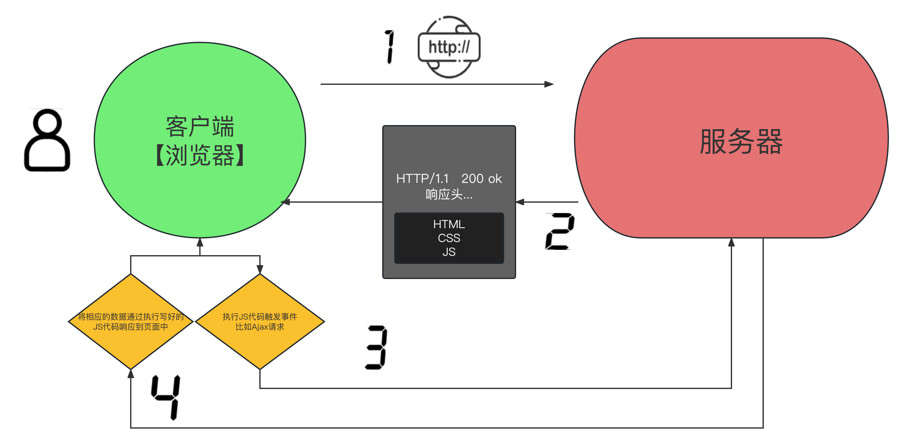

# JS基础与进阶

## 9.1、JS基础语法

 JavaScript 是一种用于在客户端（即用户的浏览器）上运行的编程语言。它是一种脚本语言，可以直接嵌入到 HTML 页面中，并由浏览器解释和执行。

在客户端环境中，JavaScript 可以与用户交互，操作和修改网页的内容、结构和样式。它可以用于处理用户输入、响应事件、进行表单验证、创建动态效果等。JavaScript 还可以通过浏览器提供的 API 访问浏览器功能，例如操作 DOM（文档对象模型）、发送网络请求、处理本地存储等。

需要注意的是，JavaScript 也可以在服务器端运行，例如使用 Node.js 环境。在服务器端，JavaScript 可以用于构建网络应用、处理后端逻辑等。但在这种情况下，它并不是典型的“客户端语言”，而是作为一种通用的脚本语言使用。

```python
from flask import Flask, render_template

app = Flask(__name__, template_folder="templates", static_folder='static')


@app.get("/index")
def index():
    return render_template("index.html")


app.run()

```

```html
<!DOCTYPE html>
<html lang="en">
<head>
    <meta charset="UTF-8">
    <title>Title</title>
    <style>
        h3 {
            color: green;
        }
    </style>

</head>
<body>

<h3>hello Alex</h3>

<script src="/static/a.js"></script>

</body>
</html>
```



### 【1】基本语法

```js
// JS代码导入方式：
// 1 直接编写
   /*
    <script>
        console.log('hello yuan')
    </script>
    */
// 2 导入文件

// <script src="hello.js"></script>


// 单行注释
/*
    这是
    多行
    注释
        */
     
// 语句分隔符 ; 表示一行代码的结束
```

### 【2】变量与数据类型

```js
// (1) 声明变量
var x;  // 声明一个变量叫x, x没有值. 此时打印x的内容是undefined(没有被定义)

// 对x进行打印看看效果.
// 在控制台记录xxxx => python中的print()
// 查看打印的内容在F12 -> Console -> 可以看到打印的内容

console.log(x);

// (2) 基本数据类型：number string  bool

var x = 3.1415; // 声明变量x, 并且给x一个初始值. 123
console.log(typeof x); // 可以查看数据类型. 但是只能看基础数据类型.

var x = "hello yuan";
console.log(typeof x); // string 字符串

var x1 = true;
var x2 = false; // 布尔值. python里面是大写的. js里面是小写.

console.log(typeof x1); // boolean 布尔. python简化成bool

// (3) 高级数据类型：  数组[]    对象{}    

var x = [1,2,3]; // 数组. => python的列表.
console.log(typeof x);  // 类型叫object

var x = {name:"yuan",age:22}; // 对象 => python的字典.
console.log(typeof x); // 也是object

// (4) 两个特殊值:   undefined null

var x; // undefined
console.log(typeof x);  // undefined类型... 不占用内存空间的

var x = null; // 空.... 是python的None, 要使用堆内存的....
console.log(typeof x); // object类型

// 一次性可以声明多个变量
var name="yuan", age=20, job="lecturer";
var a, b, c=3, d, e = 5; // 从左到右,声明5个变量, 其中, c=3, e=5

```

类型转换：
```js
// 在js中. 所有的数据和字符串相加. 结果都是字符串拼接.(重点)
var a = 123;
var b = "我爱你";
console.log(a + b);
console.log(1+1); // 2

var a = "123"; // 字符串
// 字符串转化成整数
// parse 转换
// Int 整数
a = parseInt(a);
console.log(a + 3); // 126 数学上的加法. 证明转化成功了.

var a = 123; // 转化成字符串
var b = a.toString(); // 把数字, 转化成字符串
console.log(b + 3); //"1233"

// 一般的程序员不用toString()的.
var a = 123;
var b = a + ""; // 在逆向的过程中. 这种写法是最多的.
console.log(b+333); // "123333" 字符串


var a = 123;
// 数字的toString()可以指定进制
var b = a.toString(16);
console.log(b);

var m = '7b'; // 眼睛看着是字符串. 但是我们知道它应该是一个十六进制的字符串.
// 字符串, 转化成 整数   parseInt
var n = parseInt(m, 16);
console.log(n)
```

### 【3】运算符

```js
// （1） 科学运算符
 + - * / %

// （2）比较运算符
> <   <=  >= === !==

// （3） 赋值运算符 
+= -= *= /=  ++

// 在单独使用a++和++a是没有区别的. 都是让a自增1
var b = a ++;  // 先赋值, 后运算...

console.log(a); // 11
console.log(b); // 10

var b = ++ a; // 先计算, 后赋值
console.log(a);
console.log(b);

// （4）逻辑运算符： Python中的and, or, not
// &&, 并且, 左右两端必须同时为真, 结果才能是真..
// ||, 或者, 左右两端, 有一个是真, 结果就是真
// !, 非/不, 非真即假, 非假既真.

console.log(1 > 2 || 3 < 5);
console.log(1 > 2 && 3 < 5);

console.log(!true);
console.log(!false);

// x() && y()
// 该逻辑叫短路...如果前面的表达式已经得到结果了. 后面就不运行了. 相同的逻辑还有||
// 如果x()返回真. 则运行y()
// 如果x()返回假, 则不运行y(). 直接结束判断了.


// （5）逗号运算符
a = 1,2,3,4
b = (1,"yuan",true)
// （6）三目运算：条件? 成立: 不成立
// 案例1
var a = 100;
var b = 20;
var c = a > b ? a: b;
console.log(c);
// 案例2:终极一练

let a = 10;
let b = 20;
let c = 5;
let d = 17;

let e;
let m;
e = (e = a > 3 ? b : c, m = e < b++ ? c-- : a = 3 > b % d ? 27: 37, m++);
// e = a > 3 ? b : c; // e = 20
// b = 21 , m 和 a都是37
// m = e < b++ ? c-- : a = 3 > b % d ? 27: 37;
// e = m++; // e 37  m 38  a 37
```

### 【4】流程控制语句

分支语句

```js
// 分支语句
if(条件){
     // 条件为true时,执行的代码
   }else{
     // 条件为false时,执行的代码
 }  

switch(条件){
      case 结果1:
           // 满足条件执行的结果是结果1时,执行这里的代码..
           break;
      case 结果2:
      	   // 满足条件执行的结果是结果2时,执行这里的代码..
      	   break;
      ...
      default:
           // 条件和上述所有结果都不相等时,则执行这里的代码
   }


// （1）双分支
var age = 23
if (age > 18) {
    console.log("播放成人电影！")
} else {
    console.log("播放未成年电影")
}

// （2）多分支
var score = 45;
if (score >= 90) {
    console.log("A");
} else if (score >= 80) {
    console.log("B");
} else if (score >= 70) {
    console.log("C");
} else if (score >= 60) {
    console.log("D");
} else {
    console.log("E");
}

// （3）switch多分支
var week = 3;
switch(week){
    case 1:
        console.log("星期一");
        break;
    case 2:
        console.log("星期二");
        break;
    case 3: // 某一个case匹配成功. 那么后面的case就不判断了, 直接被执行.
        console.log("星期三");
        break;
    case 4:
        console.log("星期四");
        break;
    case 5:
        console.log("星期五");
        break;
    case 6:
        console.log("星期六");
        break;
    case 7:
        console.log("星期天");
        break;
    default:
        console.log("啥也不是!");
        break;
}
```

循环语句

```js
/*

// 循环语句
while(循环的条件){
      // 循环条件为true的时候,会执行这里的代码
   }
   
// 循环三要素
for(1.声明循环的开始; 2.条件; 4.循环的计数){
   // 3. 循环条件为true的时候,会执行这里的代码
} 
 
 * 1. 首先, 会执行语句1, 通常会在语句1里完成对循环变量的初始化
 * 2. 然后, 判断表达式2计算的结果是否是真, 如果是真, 则执行循环体, 如果是假, 结束循环
 * 3. 执行完循环体后. 执行表达式3，然后回到第二步...
 
 */

// while 循环
var a = 0; // 1. 初始变量
while (a < 100) {  // 2. 条件判断
    console.log("我爱你");  // 业务需求...循环内容...
    a++;  // 3. 步进语句
}


for(var i = 0; i < 10; i++){
    console.log(i);
}

```

### 【5】字符串对象

```js
var str = "hello world";
console.log( str.length );
str.toUpperCase()
str.toLowerCase()
str.slice(3,6);
str.split(" ");
str.trim();
```

### 【6】数组

```js
// 注意, 前端js里面的数组. 相当于python的列表, java的List

// 创建数组的方法;
// 1. 直接赋值一个数组
var arr1 = [11,22,33];
console.log(arr1);

// new表示创建对象.  理解成分配内存.
var arr2 = new Array();  // var arr2 = []


// 1. push 在数组的末尾添加数据...
// 2. pop 在数组的末尾删除数据
var arr = [11,22,33,44];
arr.push(55);
var item = arr.pop();
console.log(item);


// 1 unshift 在数组的首位添加数据...  2 shift 删除数组的首位数据

var arr = [11,22,33];
arr.unshift(0); // 在数组的前面插入数据
// console.log(arr);
var item = arr.shift();
console.log(item);
console.log(arr);

var arr = ["a","b","c"];
arr.splice(1,1);
arr.splice(1,0,"b")
arr.splice(1,1,"B")

arr.reverse();

// slice(开始下标,结束下标)  切片,开区间
arr.slice(1,3)

var arr = ["北京","深圳","广州"];
console.log(arr.join(",")); // 把数组转化成字符串

// 循环和遍历
//  key       0         1       2       3       4         5
var arr = ["朱元璋", "朱允炆", "朱棣", "朱高炽", "朱高煦", "朱瞻基"];

// 三要素for循环
for(var i = 0; i < arr.length; i++){
    console.log(arr[i]);
}

// for-in
for(var x in arr){ // 此时拿到的是数组的索引(key)
    console.log(x);
}

// for-of
for (var x of arr){ // 此时拿到的是数组的元素(value)
    console.log(x);
}

// arr中的每一个元素执行里面传递进去的函数
// 回调函数的参数是 元素和索引

console.log(ret);

```

### 【7】对象

```js
 var obj = {
            "name": "yuan",
            age: 18,
            girl_friend: {
                name: "高圆圆",
                age: 28
            }
        }

  // 当他是python的字典, 无缝衔接的. `[]` 也可以翻译成`的`
  console.log(obj['girl_friend']['name']);
  // 当他是对象... 对象.属性  `.`可以翻译成`的`
  console.log(obj.name)
  console.log(obj.girl_friend.name)

  // 它俩可以混着来.
  var w = "girl_friend"
  console.log(obj[w].name);
  console.log(obj.girl_friend['name']);
  // js的对象在使用的时候. 既可以通过`[]`来获取属性的值. 也可以通过`.`来获取属性的值
  // 区别: []里面必须放字符串.
  //       .后面放的必须是属性名(不可以是字符串)
  console.log(obj.girl_friend.name); // 68

  // 如果想要对代码进行伪装,混淆. 就不能用`.`

  console.log(obj['girl_friend']['name']); // 高圆圆
  console.log(obj.girl_friend.name); // 高圆圆

  
  var obj = {};
  obj.name = "alvin";  // 对象.属性 = 值. 可以给对象增加新的属性(设置一个新的属性)
  obj['age'] = 28;

  console.log(obj);
```

序列化和反序列化：

| 方法                      | 描述                                          |
| ------------------------- | --------------------------------------------- |
| **`JSON.stringify(obj)`** | 把obj对象转换成json格式字符串，会移除对象方法 |
| **`JSON.parse(str)`**     | 把符合json语法的字符串转换成js对象            |

### 【8】其它常用对象

```js
// Math对象 Date类
var now=new Date();
console.log(now.toLocaleString( ));

// console.log(Math.random());
console.log( Math.round(Math.random() * 10 ));
```

## 9.2、函数

### 【1】函数初识

```js
 // 函数声明
 function 函数名(形参){
     return // 返回值
 }

 // 函数调用
 函数名(实参)

// 编译运行
// 默认返回undefined
// arguments参数

```

### 【2】匿名函数

匿名函数，即没有变量名的函数。在实际开发中使用的频率非常高！也是学好JS的重点。

```js
// 匿名函数赋值变量
 var foo = function () {
     console.log("这是一个匿名函数！")
 };

// 匿名函数的自执行
(function (x,y) {
     console.log(x+y);
 })(2,3)

// 匿名函数作为一个高阶函数使用
function bar() {

  return function () {
      console.log("inner函数！")
  }
}

bar()()
```

### 【3】作用域

```js
//  首先熟悉下var

var name = "yuan"; // 声明一个全局变量 name并赋值”yuan“
name = "张三";  // 对已经存在的变量name重新赋值 ”张三“
console.log(name);

age = 18   // 之前不存在age变量，这里等同于var age = 19 即声明全局变量age并赋值为18

var  gender = "male"
var  gender = "female" // 原内存释放与新内存开辟，指针指向新开辟的内存
console.log(gender)
```

作用域案例：

```js
var num = 10; // 在函数外部声明的变量, 全局变量
function func(){
    // num = 20; // 函数内部直接使用变量,则默认调用了全局的变量,
    //var num = 20;                  
    console.log("函数内部num：",num)
}
func();
console.log("全局num：",num);
```

### 【4】闭包函数

闭包（closures）是 Javascript 语言的一个难点，也是它的特色，很多高级应用都是依靠闭包实现的。闭包与变量的作用域以及变量的生命周期密切相关，本节我们就来简单介绍一下。

> 在计算机科学中，闭包（英语：Closure），又称词法闭包（Lexical Closure）或函数闭包（function closures），是引用了自由变量（外部非全局）的函数。

简单来说就是一个函数定义中引用了函数外定义的变量，并且该函数可以在其定义环境外被执行。这样的一个函数我们称之为闭包函数。

我们先看一段代码。

```html
<script>

    var key = "123456"

    function foo(){
        console.log(key)
    }

</script>

<script>

    var key = "abcdefg"

    function bar(){
        console.log(key)
    }

</script>

<script src="test01.js"></script>
<script src="test02.js"></script>
```


这就是**全局变量污染**

很明显,  虽然各自js在编写时是分开的. 但是在运行时, 是在同一个空间内执行的. 他们拥有相同的作用域. 此时的变量势必是非常非常不安全的. 那么如何来解决呢?  注意, 在js里. 变量是有作用域的. 也就是说一个变量的声明和使用是有范围的. 不是无限的. 这一点, 很容易验证.

```js
function fn(){
    let love = "爱呀"
}
fn()
console.log(love)
```

直接就报错了.  也就是说. 在js里是有全局和局部的概念的. 

直接声明在最外层的变量就是全局变量. 所有函数, 所有代码块都可以共享的. 但是反过来就不是了. 在函数内和代码块内声明的变量. 尤其是函数内. 声明出来的变量它是一个局部变量. 外界是无法进行访问的，即函数是可以开辟独立的作用域环境的。我们就可以利用这一点来给每个功能脚本创建一个局部空间. 就像这样：

```html
<script>

    var f = (function () {
        let key = "123456"

        function foo() {
            return key
        }

        return foo
    })()

</script>

<script>

    var b = (function () {
        let key = "abcdefg"

        function bar() {
            return key
        }

        return bar
    })()

</script>

```

html里面使用时:

```html
 <script src="test01.js"></script>
 <script src="test02.js"></script>
  <script>
      console.log(f())
      console.log(b())
  </script>
```

### 【5】作用域链：prototype

案例1:

```js
// 创建方式1
var foo = new Function("console.log('hello world!')")
foo()

// 创建方式2
function Person() {
      console.log("hello person")
}

var p1 = Person()
console.log(p1)

var p2 = new Person()
console.log(p2)
```

##### 什么是JS原型对象?

> 1. prototype(原型对象)就是一个容器.   {}
> 2. 存放公共的方法给对象使用.
> 3. 对象可以直接访问原型对象中的方法和属性.
> 4. 原型对象类似Python的类对象（fn.prototype）

##### 原型对象和函数之间的关系.

> - 每个函数都会有一个`prototype`属性,指向原型对象.
> - 每个原型对象都会有一个`constructor`属性,指向函数.
> - 总结:每个函数与原型对象之间的关系是`互相引用`.


##### 对象和原型对象和函数之间的关系

> - 函数创建对象`var o = new Fn();`
> - 对象通过`__proto__`属性,指向原型对象.
> - 对象可以直接调用原型对象中所有的属性和方法.
> - 对象可以通过原型对象中的constructor属性知道构造函数
> - 总结: 原型对象就是一个容器,帮助函数存放公共方法,以及给函数new出来的对象提供公共方法使用.


```js
function Dog(name, age) {
    this.name = name;//面试题：构造函数中的this指向谁？ 答：指向new创建的对象
    this.age = age;
    this.sleep = function () {
        console.log("sleeping")
    }

}

// Dog("rain",12) // 普通函数
//构造函数
let alex = new Dog("alex", 36);   // 使用new来创建对象
let eric = new Dog("eric", 35);   // 使用new来创建对象

// (1) 函数对象通过prototype容器设置公共属性和方法
Dog.prototype.eat = function (food) {
    console.log(this.name +"吃"+ food);
}

alex.eat("吃骨头")
eric.eat("吃肉")

// (2) 对象通过`__proto__`属性,指向原型对象
console.log(alex.__proto__)
console.log(alex.__proto__.constructor.name)
console.log(alex.__proto__.constructor)

// 看看能不能理解
console.log(alex.__proto__ === Dog.prototype)
console.log(Dog.prototype)

alex.age = 100
console.log(alex.age) // 先查找自己的空间，找不到，去原型中找
console.log(eric.age)

// 猜一猜1
Dog.prototype.sleep =function (){
    console.log("prototype sleeping")
}

alex.sleep()

// 猜一猜2
let zhangSan = new Dog("张三", 35);
Dog.prototype = {
    fly:function (){
        console.log("flying...")
    }
}
// let zhangSan = new Dog("张三", 35);
// zhangSan.fly()
zhangSan.eat("辣条")

```

### 【6】call和apply方法

call，apply都属于Function.prototype的一个方法，它是JavaScript引擎内在实现的，因为属于Function.prototype，所以每个Function对象实例(就是每个方法)都有call，apply属性。既然作为方法的属性，那它们的使用就当然是针对方法的了，这两个方法是容易混淆的，因为它们的作用一样，只是使用方式不同。

```js
foo.call(this, arg1,arg2,arg3) == foo.apply(this, arguments) == this.foo(arg1, arg2, arg3);
```

案例1:

```js
function Person(name, age) {
    this.name = name
    this.age = age
}

Person.prototype.eat = function () {
    console.log(this.name + "正在吃东西")
}

p = new Person("yuan", 22)

p.eat()
```

案例2:

```js
function Person(name, age) {
    this.name = name
    this.age = age
}
p = new Person("yuan", 22)

function eat () {
    console.log(this.name + "正在吃东西")
}
eat.call(p)
```

案例3:

```js
function Person(name, age) {
    this.name = name
    this.age = age
}
p = new Person("yuan", 22)

function eat () {
    console.log(this.name + "正在吃东西")
}
eat.call(p)
eat.apply(p)
```

> 如果call和apply的第一个参数写的是null，那么this指向的是window对象

案例4:

```js
function Person(name, age) {
    this.name = name
    this.age = age
}

p = new Person("yuan", 22)

function eat(a, b, c) {
    console.log(this.name + "正在吃东西")
    console.log(a, b, c)
}

eat.call(p, "1", "2", "3")
eat.apply(p, ["1", "2", "3"])
// apply传递多个参数的时候第二个参数需要传递一个数组
```

### 【7】 eval函数

eval() 函数计算 JavaScript 字符串，并把它作为脚本代码来执行。

如果参数是一个表达式，eval() 函数将执行表达式。如果参数是Javascript语句，eval()将执行 Javascript 语句。

```js
eval(string)
// 
eval('[1,2,3,4,5].map(x=>x*x)')
```

> http://tools.jb51.net/password/evalencode


### 【8】Hook函数

在 JS 逆向中，我们通常把替换原函数的过程都称为 Hook。

```js
function foo() {
    console.log("foo功能...")
    return 123
}
foo()

var _foo = foo

foo = function () {
    console.log("截断开始...")
    debugger;
    _foo()
    console.log("截断结束...")
}
```

```js
function foo(a, b, c, d, e, f) {
    console.log("foo功能...")
    console.log(a, b, c, d, e, f)
    return 123
}

var _foo = foo

foo = function () {
    console.log("截断开始...")
    // _foo(arguments)
    _foo.apply(this,arguments)
    console.log("截断结束...")
}

foo(1,2,3,4,5,6,7)
```

#### 案例1: Hook eval

```js
console.log("程序开始")
// eval("console.log('yuan')")
window["e"+"v"+"a"+"l"]("console.log('eval yuan')")
console.log("程序结束")
```

````js
var _eval = eval

eval = function (src) {
    console.log("eval截断开始...")
    debugger;
    _eval.apply(this, src)
    console.log("eval截断结束...")
}
````

#### 案例2: Hook JSON.stringify

JSON.stringify() 方法用于将 JavaScript 值转换为 JSON 字符串，在某些站点的加密过程中可能会遇到，以下代码演示了遇到 JSON.stringify() 时，则插入断点：

```js
(function() {
    var stringify = JSON.stringify;
    JSON.stringify = function(params) {
        console.log("Hook JSON.stringif:::", params);
        debugger;
        return stringify(params);
    }
})();
```

#### 案例3: Hook JSON.parse

JSON.parse() 方法用于将一个 JSON 字符串转换为对象，在某些站点的加密过程中可能会遇到，以下代码演示了遇到 JSON.parse() 时，则插入断点：

```js
(function() {
    var parse = JSON.parse;
    JSON.parse = function(params) {
        console.log("Hook JSON.parse::: ", params);
        debugger;
        return parse(params);
    }
})();
```

#### 案例4: Hook Cookie

一般使用Object.defineProperty()来进行属性操作的hook。那么我们了解一下该方法的使用。

```apl
Object.defineProperty(obj, prop, descriptor)

// 参数
obj：对象；
prop：对象的属性名；
descriptor：属性描述符；
```

一般hook使用的是get和set方法，下边简单演示一下

```js
var people = {
    name: '张三',
};

Object.defineProperty(people, 'age', {
    get: function () {
        console.log('获取值！');
        return count;
    },
    set: function (val) {
        console.log('设置值！');
        count = val + 1;
    },
});

people.age = 18;
console.log(people.age);
```

通过这样的方法，我们就可以在设置某个值的时候，添加一些代码，比如 debugger;，让其断下，然后利用调用栈进行调试，找到参数加密、或者参数生成的地方，需要注意的是，网站加载时首先要运行我们的 Hook 代码，再运行网站自己的代码，才能够成功断下，这个过程我们可以称之为 Hook 代码的注入。

```js
(function(){
   'use strict'
    var _cookie = "";
    Object.defineProperty(document, 'cookie', {
        set: function(val) {
            console.log(val);
            debugger
            _cookie = val;
            return val;
        },
        get: function() {
            return _cookie;
        },
});
})()
```

### 【9】Promise对象

Promise是JavaScript中一种用于处理异步操作的对象。它用于表示一个可能尚未完成并且需要等待结果的操作，并且可以使用Promise实例来处理操作完成后的结果。

一个Promise对象有三种状态：pending（等待中）、fulfilled（已成功）或rejected（已失败）。当Promise对象处于pending状态时，它表示尚未完成，但可能会在未来某个时间完成。如果Promise成功地解决了其值，它将进入已成功状态，并将返回一个值。如果Promise无法解决其值，则会进入已失败状态，并返回一个错误。

Promise可以使用`then()`和`catch()`方法来处理操作完成后的结果。`then()`方法用于处理已成功的Promise对象，它接受一个回调函数作为参数，当Promise对象成功时会调用该函数并传递解决的值。`catch()`方法用于处理已失败的Promise对象，它接受一个回调函数作为参数，当Promise对象被拒绝时会调用该函数并传递拒绝的原因。

Promise可以嵌套使用，以便处理多个异步操作。在这种情况下，可以使用`Promise.all()`方法来等待所有Promise对象完成，并在它们都完成后执行一些操作。

使用Promise可以更好地处理异步操作，例如网络请求，文件读取等。它避免了回调地狱（callback hell）的问题，使得代码更加容易理解和维护。

#### 基本语法

```js
// 创建一个返回Promise对象的函数
function fetchData() {
    // 创建一个新的Promise对象
    return new Promise(function (resolve, reject) {
        // 模拟异步操作，例如加载数据
        setTimeout(function () {
            var data = {code: 1000, data: {name: 'John', age: 30}};

            if (data.code === 1001) {
                // 如果成功，则解决Promise并返回数据
                resolve(data);
            } else {
                // 如果出现错误，则拒绝Promise并返回错误对象
                reject(new Error('Failed to load data'));
            }
        }, 2000);
    });
}

// 调用fetchData()函数并处理Promise对象的结果
fetchData().then(function (data) {
    // 如果Promise对象成功解决，执行这里的代码
    console.log('Data loaded:', data);
}).catch(function (error) {
    // 如果Promise对象被拒绝，执行这里的代码
    console.log('Error loading data:', error);
});
```

#### 回调地狱

```js
// 使用回调函数处理异步操作
function getData(callback) {
    // 异步操作
    setTimeout(function () {
        var data = {name: 'John', age: 30};
        callback(data);
        // callback(new Error('Failed to load data'));
    }, 2000);
}

// 另一个使用回调函数处理异步操作的函数
function getUserDetails(name, callback) {
    // 异步操作
    setTimeout(function () {
        var details = {name: name, email: 'john@example.com'};
        callback(details);
        // callback(new Error('Failed to load user details'));
    }, 2000);
}

// 回调函数c1
function c1(data) {
    // 第一个异步操作完成后执行此处的代码
    console.log('Data loaded:', data);
    getUserDetails(data.name, c2);
}

function c2(details) {
    // 第二个异步操作完成后执行此处的代码
    console.log('User details:', details);
}

// 使用回调地狱
getData(c1);
```

```js
  // 使用Promise对象处理异步操作
  function getData() {
      return new Promise(function (resolve, reject) {
          // 异步操作
          setTimeout(function () {
              var data = {name: 'John', age: 30};
              resolve(data);
              // reject(new Error('Failed to load data'));
          }, 2000);
      });
  }

  // 另一个使用Promise对象处理异步操作的函数
  function getUserDetails(name) {
      return new Promise(function (resolve, reject) {
          // 异步操作
          setTimeout(function () {
              var details = {name: name, email: 'john@example.com'};
              resolve(details);
              // reject(new Error('Failed to load user details'));
          }, 2000);
      });
  }

  // 使用Promise对象避免回调地狱
  getData()
      .then(function (data) {
          // 第一个异步操作完成后执行此处的代码
          console.log('Data loaded:', data);
          return getUserDetails(data.name);
      })
      .then(function (details) {
          // 第二个异步操作完成后执行此处的代码
          console.log('User details:', details);
      })
      .catch(function (error) {
          // 如果发生错误，则执行此处的代码
          console.log('Error:', error);
      });
```

#### Promise与ajax请求

```js
  // 创建一个返回Promise对象的函数，该函数使用Ajax发送请求并在响应可用时解决Promise对象
  function fetchData(url) {
      return new Promise(function (resolve, reject) {
          var xhr = new XMLHttpRequest();
          xhr.open('GET', url);
          xhr.onload = function () {
              if (xhr.status === 200) {
                  resolve(xhr.responseText);
              } else {
                  reject(Error(xhr.statusText));
              }
          };
          xhr.onerror = function () {
              reject(Error('Network Error'));
          };
          xhr.send();
      });
  }

  // 调用fetchData()函数并处理Promise对象的结果
  fetchData('https://v0.yiketianqi.com/api?unescape=1&version=v9&appid=47284135&appsecret=jlmX3A6s').then(function (response) {
      // 如果Promise对象成功解决，执行这里的代码
      console.log('Data loaded:', response);
  }).catch(function (error) {
      // 如果Promise对象被拒绝，执行这里的代码
      console.log('Error loading data:', error);
  });

```

## 9.3 、window对象 

window 是客户端浏览器对象模型的基类，window 对象是客户端 JavaScript 的全局对象。一个 window 对象实际上就是一个独立的窗口，对于框架页面来说，浏览器窗口每个框架都包含一个 window 对象。

### （1）全局作用域

在客户端浏览器中，window 对象是访问 BOM 的接口，如引用 document 对象的 document 属性，引用自身的 window 和 self 属性等。同时 window 也为客户端 JavaScript 提供全局作用域。

由于 window 是全局对象，因此所有的全局变量都被解析为该对象的属性。

```html
<script>

    var username = "yuanhao";  //全局变量
    function f() {  //全局函数
        console.log(username);
    }

    console.log(window.username);  //返回字符串“yuanhao”
    window.f();  //返回字符串“yuanhao”

</script>


```

### （2）使用系统对话框

window 对象定义了 3 个人机交互的方法，主要方便对 JavaScript 代码进行调试。

- alert()：确定提示框。由浏览器向用户弹出提示性信息。该方法包含一个可选的提示信息参数。如果没有指定参数，则弹出一个空的对话框。
- confirm()：选择提示框。。由浏览器向用户弹出提示性信息，弹出的对话框中包含两个按钮，分别表示“确定”和“取消”按钮。如果点击“确定”按钮，则该方法将返回 true；单击“取消”按钮，则返回 false。confirm() 方法也包含一个可选的提示信息参数，如果没有指定参数，则弹出一个空的对话框。
- prompt()：输入提示框。可以接收用户输入的信息，并返回输入的信息。prompt() 方法也包含一个可选的提示信息参数，如果没有指定参数，则弹出一个没有提示信息的输入文本对话框。

### （3）访问客户端对象

使用 window 对象可以访问客户端其他对象，这种关系构成浏览器对象模型，window 对象代表根节点，浏览器对象关系的关系如图所示，每个对象说明如下。

- window：客户端 JavaScript 顶层对象。每当 <body> 或 <frameset> 标签出现时，window 对象就会被自动创建。
- navigator：包含客户端有关浏览器信息。
- screen：包含客户端屏幕的信息。
- history：包含浏览器窗口访问过的 URL 信息。
- location：包含当前网页文档的 URL 信息。
- document：包含整个 HTML 文档，可被用来访问文档内容及其所有页面元素。


### （4）使用定时器

window 对象包含 4 个定时器专用方法，说明如下表所示，使用它们可以实现代码定时执行，或者延迟执行，使用定时器可以设计演示动画。

| 方法            | 说明                                             |
| --------------- | ------------------------------------------------ |
| setInterval()   | 按照执行的周期（单位为毫秒）调用函数或计算表达式 |
| setTimeout()    | 在指定的毫秒数后调用函数或计算表达式             |
| clearInterval() | 取消由 setInterval() 方法生成的定时器            |
| clearTimeout()  | 取消由 setTimeout() 方法生成的定时器             |

setTimeout() 方法能够在指定的时间段后执行特定代码。用法如下：

`var o = setTimeout(code, delay)`

参数 code 表示要延迟执行的字符串型代码，将在 Windows 环境中执行，如果包含多个语句，应该使用分号进行分隔。delay 表示延迟时间，以毫秒为单位。

该方法返回值是一个 Timer ID，这个 ID 编号指向延迟执行的代码控制句柄。如果把这个句柄传递给 clearTimeout() 方法，则会取消代码的延迟执行。

```html
<!DOCTYPE html>
<html lang="en">
<head>
    <meta charset="UTF-8">
    <title>Title</title>


</head>
<body>

<input id="ID1" type="text" >
<button onclick="begin()">开始</button>
<button onclick="end()">停止</button>

<script>
    function showTime(){
           var nowd2=new Date().toLocaleString();
           var temp=document.getElementById("ID1");
           temp.value=nowd2;

    }
    var ID;
    function begin(){
        if (ID==undefined){
             showTime();
             ID=setInterval(showTime,1000);
        }
    }
    function end(){
        clearInterval(ID);
        ID=undefined;
    }

</script>

</body>
</html>
```

## 9.4、jQuery

jQuery是一个快速、简洁的JavaScript框架，是继Prototype之后又一个优秀的JavaScript代码库（*或JavaScript框架*）。jQuery设计的宗旨是“write Less，Do More”，即倡导写更少的代码，做更多的事情。它封装JavaScript常用的功能代码，提供一种简便的JavaScript设计模式，优化HTML文档操作、事件处理、动画设计和Ajax交互。

jQuery的核心特性可以总结为：具有独特的链式语法和短小清晰的多功能接口；具有高效灵活的css选择器，并且可对CSS选择器进行扩展；拥有便捷的插件扩展机制和丰富的插件。jQuery兼容各种主流浏览器，如IE 6.0+、FF 1.5+、Safari 2.0+、Opera 9.0+等

目前在市场上, 1.x , 2.x, 3.x 功能的完善在1.x, 2.x的时候是属于删除旧代码,去除对于旧的浏览器兼容代码。3.x的时候增加es的新特性以及调整核心代码的结构

根本上jquery就是一个写好的js文件,所以想要使用jQuery的语法必须先引入到本地

```html
<script src="https://cdn.bootcdn.net/ajax/libs/jquery/3.5.1/jquery.js"></script>
```

#### 查找标签

```go
/*
基本选择器 :

$("#id")   
$(".class")  
$("element")  
$(".class,p,div")

后代选择器：
$(".outer div") 

筛选器：
  $().first()       
  $().last()          
  $().eq()     
  
导航查找：  

$("div").children(".test")     
$("div").find(".test")  
                               
// 向下查找兄弟标签 
$(".test").next()               

// 查找所有兄弟标签  
$("div").siblings()  
              
// 查找父标签：         
$(".test").parent() 
  
*/
```

#### 绑定事件

```js
// 绑定事件
$().on("事件名",匿名函数)
```

#### 操作标签

* 文本操作

```jquery
$("选择符").html()     // 读取指定元素的内容,如果$()函数获取了有多个元素,提取第一个元素
$("选择符").html(内容) // 修改内容,如果$()函数获取了多个元素, 则批量修改内容
```

* value操作

```jquery
$().val()
```

* 属性操作

```jquery
//读取属性值
	$("选择符").attr("属性名");   // 获取非表单元素的属性值,只会提取第一个元素的属性值
//操作属性
  $("选择符").attr("属性名","属性值");  // 修改非表单元素的属性值,如果元素有多个,则全部修改
```

* css样式操作

```js
// 操作样式
$().css("样式属性","样式值")
```

* class 属性操作

```js
$().addClass("class1  class2 ... ...")   // 给获取到的所有元素添加指定class样式
$().removeClass() // 给获取到的所有元素删除指定class样式
$().toggleClass() // 给获取到的所有元素进行判断,如果拥有指定class样式的则删除,如果没有
```

### Ajax请求

Ajax，一般中文称之为："阿贾克斯"，是英文 “Async Javascript And Xml”的简写，译作：异步js和xml传输数据技术。

ajax的作用： ajax可以让js代替浏览器向后端程序发送**`http`**请求，与后端通信，在用户不知道的情况下操作数据和信息，从而实现页面局部刷新数据/无刷新更新数据。

所以开发中ajax是很常用的技术，主要用于操作后端提供的`数据接口`，从而实现网站的`前后端分离`。

ajax技术的原理是实例化js的XMLHttpRequest对象，使用此对象提供的内置方法就可以与后端进行数据通信。

##### 数据接口

数据接口，也叫api接口，表示`后端提供`操作数据/功能的url地址给客户端使用。

客户端通过发起请求向服务端提供的url地址申请操作数据【操作一般：增删查改】

同时在工作中，大部分数据接口都不是手写，而是通过函数库/框架来生成。

##### ajax的使用

ajax的使用必须与服务端程序配合使用，但是开发中我们对于ajax请求的数据，不仅仅可以是自己写的服务端代码，也可以是别人写好的数据接口进行调用。

数据接口：

```apl
# 天气接口
https://v0.yiketianqi.com/api?unescape=1&version=v91&appid=43656176&appsecret=I42og6Lm&ext=&cityid=&city=

# 音乐接口
https://c.y.qq.com/v8/fcg-bin/fcg_v8_toplist_cp.fcg?g_tk=5381&uin=0&format=json&inCharset=utf-8&outCharset=utf-8%C2%ACice=0&platform=h5&needNewCode=1&tpl=3&page=detail&type=top&topid=36&_=1520777874472%E4%BD%9C%E8%80%85%EF%BC%9Atsia%E9%93%BE%E6%8E%A5%EF%BC%9Ahttps://www.jianshu.com/p/67e4bd47d981
```


# JS逆向高级爬虫

JS逆向的目的是通过运行本地JS的文件或者代码,以实现脱离他的网站和浏览器,并且还能拿到和浏览器加密一样的效果。

## 10.1、编码算法

###  【1】一切从MD5开始

MD5是一个非常常见的摘要(hash)逻辑.  其特点就是小巧. 速度快. 极难被破解. 所以, md5依然是国内非常多的互联网公司选择的密码摘要算法. 

> 1. 这玩意不可逆. 所以. 摘要算法就不是一个加密逻辑. 
>
> 2. 相同的内容计算出来的摘要是一样的
>
> 3. 不同的内容(哪怕是一丢丢丢丢丢不一样) 计算出来的结果差别非常大

在数学上. 摘要其实计算逻辑就是hash. 

hash(数据)  => 数字

 	1. 密码
 	2. 一致性检测  

md5的python实现:

```python
from hashlib import md5

obj = md5()
obj.update("yuan".encode("utf-8"))
# obj.update("alex".encode('utf-8'))  # 可以添加多个被加密的内容

bs = obj.hexdigest()
print(bs)
```


我们把密文丢到网页里. 发现有些网站可以直接解密. 但其实不然. 这里并不是直接解密MD5. 而是"撞库". 

就是它网站里存储了大量的MD5的值. 就像这样:


而需要进行查询的时候. 只需要一条select语句就可以查询到了. 这就是传说中的撞库. 

如何避免撞库: md5在进行计算的时候可以加盐. 加盐之后. 就很难撞库了. 

```python
from hashlib import md5


salt = "我是盐.把我加进去就没人能破解了"
obj = md5(salt.encode("utf-8"))  # 加盐
obj.update("alex".encode("utf-8"))

bs = obj.hexdigest()
print(bs)
```


扩展; sha256

```python
from hashlib import sha1, sha256
sha = sha256(b'salt')
sha.update(b'alex')
print(sha.hexdigest())
```

不论是sha1, sha256, md5都属于摘要算法. 都是在计算hash值. 只是散列的程度不同而已. 这种算法有一个特性. 他们是散列. 不是加密. 而且, 由于hash算法是不可逆的, 所以不存在解密的逻辑.

### 【2】url编码

```python
import urllib.parse

# s = 'a'
s = ' 123'
ret = urllib.parse.quote(s)
print(ret)
s = urllib.parse.unquote(ret)
print(s)

params = {'name': '张三', 'age': 20, 'address': '北京市海淀区'}
query_string = urllib.parse.urlencode(params)
print(query_string)

query_string = 'name=%E5%BC%A0%E4%B8%89&age=20&address=%E5%8C%97%E4%BA%AC%E5%B8%82%E6%B5%B7%E6%B7%80%E5%8C%BA'
params = urllib.parse.parse_qs(query_string)
print(params, type(params))
```

### 【3】 base64编码

#### （1）base64是什么

Base64编码，是由64个字符组成编码集：**26个大写字母A~Z，26个小写字母a~z，10个数字0~9，符号“+”与符号“/”**。Base64编码的基本思路是**将原始数据的三个字节拆分转化为四个字节**，然后根据Base64的对应表，得到对应的编码数据。

当原始数据凑不够三个字节时，编码结果中会使用额外的**符号“=”**来表示这种情况。

#### （2）base64原理


一个Base64字符实际上代表着6个二进制位(bit)，4个Base64字符对应3字节字符串/二进制数据。

3个字符为一组的的base64编码方式如：


小于3个字符为一组的编码方式如：


总结：base64过程


最后处理完的编码字符再转字节中不再有base64以外的任何字符。

#### （3）base64测试

```python
import base64

bs = "you".encode("utf-8")
# 把字节转化成b64
print(base64.b64encode(bs).decode())

bs = "yo".encode("utf-8")
# 把字节转化成b64
print(base64.b64encode(bs).decode())

# 猜测结果
bs = "y".encode("utf-8")
# 把字节转化成b64
print(base64.b64encode(bs).decode())


```

注意, b64处理后的字符串长度. 一定是4的倍数. 如果在网页上看到有些密文的b64长度不是4的倍数. 会报错

例如, 

```python
import base64

s = "eW91"
ret = base64.b64decode(s)
print(ret)

s = "eW91eQ=="
ret = base64.b64decode(s)
print(ret)

s = "eW91eQ"
ret = base64.b64decode(s)
print(ret)
```

解决思路. base64长度要求. 字符串长度必须是4的倍数. 填充一下即可

```python
s = "eW91eQ"
# ret = base64.b64decode(s)
# print(ret)

s += ("=" * (4 - len(s) % 4))
print("填充后", s)
ret = base64.b64decode(s).decode()
print(ret)
```

#### （4）base64变种

```python
# 方式1
data = res.text.replace("-", "+").replace("_", "/")
base64.b64decode(data)
# 方式2
data = base64.b64decode(res.text, altchars=b"-_")  # base64解码成字节流
```

#### （5）为什么要base64编码

base64 编码的优点：

- 算法是编码，不是压缩，编码后只会增加字节数（一般是比之前的多1/3，比如之前是3， 编码后是4）
- 算法简单，基本不影响效率
- 算法可逆，解码很方便，不用于私密传输。
- 毕竟编码了，肉眼不能直接读出原始内容。
- 加密后的字符串只有【0-9a-zA-Z+/=】 ，不可打印字符（转译字符）也可以传输（关键！！！）

有些网络传输协议是为了传输`ASCII文本`设计的，当你使用其传输二进制流时（比如视频/图片），二进制流中的数据可能会被协议错误的识别为控制字符等等，因而出现错误。那这时就要将二进制流传输编码，因为有些8Bit字节码并没有对应的ASCII字符。

比如十进制ASCII码8对应的是后退符号(backspace), 如果被编码的数据中包含这个数值，那么编码出来的结果在很多编程语言里会导致前一个字符被删掉。又比如ASCII码0对应的是空字符，在一些编程语言里代表字符串结束，后续的数据就不会被处理了。

用Base64编码因为限定了用于编码的字符集，确保编码的结果可打印且无歧义。

不同的网络节点设备交互数据需要：设备A把base64编码后的数据封装在`json字符串`里，设备B先解析json拿到value，再进行base64解码拿到想要的数据。

> 1. 早年制定的一些协议都是只支持文本设定的。随着不断发展需要支持非文本了，才搞了一个base64做兼容
>
> 2. 虽然编码之后的数据与加密一样都具有不可见性，但编码与加密的概念并不一样。编码是公开的，任何人都可以解码；而加密则相反，你只希望自己或者特定的人才可以对内容进行解密。

base64处理图片数据：

```python
import base64
source = "data:image/png;base64,iVBORw0KGgoAAAANSUhEUgAAACAAAAAgCAMAAABEpIrGAAAA7VBMVEUAAAD////////s8v////+txP+qwv+4zf/w9f/2+P+hu//Q3f+yyP+4zf/Q3f////+kvv+90P+80f+2yv/S4P/T4P/M2//z9/+cuP/V4P9Whv////9Uhf9Sg/9Pgf9NgP/8/f9di/9Xh/9lkf5aif9qlP7z9//k7P/c5v+2y/94nv51nP6lv/+LrP6Ep/6BpP5gjf7v9P+wxv/U4f/M2/+sxP+vxv73+f/P3v/J2v+5zf+ivP+fuv9xmf+Ytv6Usv6Hqf58of5vl/7m7v/g6f+zyf6QsP75+//q8P/B0v/W4//C1P6+0P6qwv6ct/76fHZiAAAAGnRSTlMAGAaVR/Py45aC9Mfy2b8t9OPZ2ce/v4L0x/e74/EAAAIZSURBVDjLZVPXYuIwEDSmQ4BLv5O0ku3Yhwu2IZTQe0hy7f8/57QSoYR5sVea1c424wgzl324LRRuH7I507hEJluYucCFEOBGhWzmy7X5+N0WwIjTbrcdBsKulM0z96onGCGE2X6n+cTkj/CqJ480igzkNXp26E9JkABSbBz8i4Bn3EkH840mKHoxs49fZQzt2Kd03FQEzSB3WsejB9Jqf1CJQBM0wCurABWBoub0gkDENwyStTHA62pwSWDtklRQ4FLfjnaiPqVW60hAYeLKNHIREOZuKTL80H6XBFCwn4BAmDOyLiOQUIlOSEjaoS+Ju57NZuul73Fml4w6yAivSLBW3MGfcfBmIegmArg3alICdJHgy1jQt8Z/6CcC4DdGXhLIoiWRACpbLYbDYW80GnXp2GH8ShP+PUvEoHsAIFq9Xm8+kXlIwkkI9pm+05Tm3yWqu9EiB0pkwjWBx2i+tND1XqeZqpPU4VhUbq/ekR8CwTRVoRxf3ifTbeIwcONNsJZ2lxFVKDMv1KNvS2zXdrnD+COvR1PQpTZKNlKD3cLCOJNnivgVxkw169BunlKFaV9/B+LQbqOsByY4IVgDB59dl/cjR9TIJV1Lh7CGqUqH/DDPhhZYOPkdLz6m0X7GrzPHsSe6zJwzxvm+5NeNi8U5ABfn7mz7zHJFrZ6+BY6rd7m8kQtcAtwwXzq4n69/vZbP1+pn6/8fsrRmHUhmpYYAAAAASUVORK5CYII="
s = source.split(",")[1]
with open("a.png", "wb") as f:
    f.write(base64.b64decode(s))

```

### 【4】对称加密（AES与DES）

AES是一种对称加密，所谓对称加密就是加密与解密使用的秘钥是一个。

常见的对称加密: AES, DES, 3DES. 我们这里讨论AES。

安装：

```python
pip install pycryptodome
```

AES 加密最常用的模式就是 ECB模式 和 CBC 模式，当然还有很多其它模式，他们都属于AES加密。ECB模式和CBC 模式俩者区别就是 ECB 不需要 iv偏移量，而CBC需要。

```apl
参数	作用及数据类型

1. 秘钥	加密的时候用秘钥，解密的时候需要同样的秘钥才能解出来; 数据类型为bytes
2. 明文	需要加密的参数; 数据类型为bytes
3. 模式	aes 加密常用的有 ECB 和 CBC 模式（我只用了这两个模式，还有其他模式）;数据类型为aes类内部的枚举量
iv 偏移量	这个参数在 ECB 模式下不需要，在 CBC 模式下需要；数据类型为bytes

"""
长度
    16: *AES-128*
    24: *AES-192*
    32: *AES-256*
    
MODE 加密模式. 
    常见的ECB, CBC
    ECB：是一种基础的加密方式，密文被分割成分组长度相等的块（不足补齐），然后单独一个个加密，一个个输出组成密文。
    CBC：是一种循环模式，前一个分组的密文和当前分组的明文异或或操作后再加密，这样做的目的是增强破解难度。
"""
```

CBC加密案例：

```python
from Crypto.Cipher import AES
import base64

key = '1234567890123456'.encode()  # 秘钥
# 秘钥：必须是16位字节或者24位字节或者32位字节
text = 'alex is dsb!!!!!'
# text = 'alex is dsb'  # 需要加密的内容
# while len(text.encode('utf-8')) % 16 != 0:  # 如果text不足16位的倍数就用空格补足为16位
#     text += '\0'
text = text.encode()
print("完整text:", text)

iv = b'abcdabcdabcdabcd'   #偏移量--必须16字节

aes = AES.new(key, AES.MODE_CBC,iv)  # 创建一个aes对象

en_text = aes.encrypt(text)  # 加密明文
print("aes加密数据:::", en_text)

en_text = base64.b64encode(en_text).decode()  # 将返回的字节型数据转进行base64编码
print(en_text)  # rRPMWCaOBYahYnKUJzq65A==
```

CBC解密案例：

````python
from Crypto.Cipher import AES
import base64

key = '1234567890123456'.encode()  # 秘钥
# 秘钥：必须是16位字节或者24位字节或者32位字节（因为python3的字符串是unicode编码，需要 encode才可以转换成字节型数据）
model = AES.MODE_CBC  # 定义模式
iv = b'abcdabcdabcdabcd'
aes = AES.new(key, model, iv)  # 创建一个aes对象

text = 'J8bwyhYt1chAPAGu8N6kKA=='.encode()  # 需要解密的文本
ecrypted_base64 = base64.b64decode(text)  # base64解码成字节流
str = aes.decrypt(ecrypted_base64).decode()  # 解密

print("aes解密数据:::")

````

> 1. 在Python中进行AES加密解密时，所传入的密文、明文、秘钥、iv偏移量、都需要是bytes（字节型）数据。python 在构建aes对象时也只能接受bytes类型数据。
> 1. 当秘钥，iv偏移量，待加密的明文，字节长度不够16字节或者16字节倍数的时候需要进行补全。
>
> 3. CBC模式需要重新生成AES对象，为了防止这类错误，无论是什么模式都重新生成AES对象就可以了。

### 【5】非对称加密(RSA)

非对称加密. 加密和解密的秘钥不是同一个秘钥. 这里需要两把钥匙. 一个公钥, 一个私钥.  公钥发送给客户端. 发送端用公钥对数据进行加密. 再发送给接收端, 接收端使用私钥来对数据解密. 由于私钥只存放在接受端这边. 所以即使数据被截获了. 也是无法进行解密的. 

[公钥和私钥](https://blog.csdn.net/Ruishine/article/details/114705443)

常见的非对称加密算法: RSA, DSA等等, 我们就介绍一个. RSA加密, 也是最常见的一种加密方案

1. 创建公钥和私钥

```python
from Crypto.PublicKey import RSA

# 生成秘钥
rsakey = RSA.generate(1024)
with open("rsa.public.pem", mode="wb") as f:
    f.write(rsakey.publickey().exportKey())

with open("rsa.private.pem", mode="wb") as f:
    f.write(rsakey.exportKey())
```

2. 加密

```python
from Crypto.PublicKey import RSA
from Crypto.Cipher import PKCS1_v1_5
import base64


# 加密
data = "我喜欢你"
with open("rsa.public.pem", mode="r") as f:
    pk = f.read()
    rsa_pk = RSA.importKey(pk)
    rsa = PKCS1_v1_5.new(rsa_pk)

    result = rsa.encrypt(data.encode("utf-8"))
    # 处理成b64方便传输
    b64_result = base64.b64encode(result).decode("utf-8")
    print(b64_result)

```

3. 解密

```python
from Crypto.PublicKey import RSA
from Crypto.Cipher import PKCS1_v1_5
import base64

data = "BkiKG8jzVGzbWOl4m8NXJEYglgtxhOB05MGmap8JSP97GzoewPBmDTs7c5iACUof3k/uJf0H88GygajVgBvkcbckJp7oO+Qj6VSUQYTOHhKN/VG2a8v+WzL34EO/S7BYoj2oOxIDAr8wDLxYxjBeXq/Be6Q1yBbnZcKaMkifhP8="
# 解密
with open("rsa.private.pem", mode="r") as f:
    prikey = f.read()
    rsa_pk = RSA.importKey(prikey)
    rsa = PKCS1_v1_5.new(rsa_pk)
    result = rsa.decrypt(base64.b64decode(data), None)
    print("rsa解密数据:::", result.decode("utf-8
```

## 10.2、PyExecJS模块

pyexecjs是一个可以帮助我们运行js代码的一个第三方模块.  其使用是非常容易上手的. 

但是它的运行是要依赖能运行js的第三方环境的. 这里我们选择用node作为我们运行js的位置. 

```
pip install pyexecjs
```

测试一下:

````python
import execjs
print(execjs.get().name)  # 需要重启pycharm或者重启电脑 Node.js (V8)
````

简单使用

```python
import execjs

print(execjs.get().name)

# execjs.eval 可以直接运行js代码并得到结果
js = """
"a,b,c,d".split(",")
"""
res = execjs.eval(js)
print(res)

# execjs.compile(),  call()
# execjs.compile() 事先加载好一段js代码,
jj = execjs.compile("""
    function foo(a, b){
        return a + b    
    }
""")
# call() 运行代码中的xxx函数. 后续的参数是xxx的参数
ret = jj.call("foo", 10, 20)
print(ret)
```

windows中如果出现编码错误. 在引入execjs之前. 插入以下代码即可.

```python
import subprocess
from functools import partial
subprocess.Popen = partial(subprocess.Popen, encoding='utf-8')

import execjs
```

## 10.3、JS逆向实战必备案例

### 【1】逆向案例之某道翻译

#### Part01:逆向请求

##### （1）抓包


##### （2）获取JS的请求入口

获取请求入口:搜索关键字，比如sign（有时候太多不好用），比如请求路径


##### （3）获取构建数据的目标函数

分析请求参数


##### （4）获取目标函数源码位置

方式1:


方式2:


##### （5） 逆向实现


```python
# Python逆向模拟：
import time
import hashlib
import requests

session = requests.session()
session.get("https://fanyi.youdao.com/")
word = "apple"
# (1) 构建sign值
t = str(1683620934858)
s = f"client=fanyideskweb&mysticTime={t}&product=webfanyi&key=fsdsogkndfokasodnaso"
md5 = hashlib.md5()
md5.update(s.encode())
sign = md5.hexdigest()

print("sign:::", sign)
# sign::: d246611271b76b9cbf43bb075a3d5ccb
```


md5是标准的，没有魔改，程序员是个好人！

完整的逆向代码也就出来了：


结果为：

```apl
Z21kD9ZK1ke6ugku2ccWu-MeDWh3z252xRTQv-wZ6jddVo3tJLe7gIXz4PyxGl73nSfLAADyElSjjvrYdCvEP4pfohVVEX1DxoI0yhm36ytQNvu-WLU94qULZQ72aml6JKK7ArS9fJXAcsG7ufBIE0gd6fbnhFcsGmdXspZe-8whVFbRB_8Fc9JlMHh8DDXnskDhGfEscN_rfi-A-AHB3F9Vets82vIYpkGNaJOft_JA-m5cGEjo-UNRDDpkTz_NIAvo5PbATpkh7PSna2tHcE6Hou9GBtPLB67vjScwplB96-zqZKXJJEzU5HGF0oPDY_weAkXArzXyGLBPXFCnn_IWJDkGD4vqBQQAh2n52f48GD_cb-PSCT_8b-ESsKUI9NJa11XsdaUZxAc8TzrYnXwdcQbtl_kZGKhS6_rCtuNEBouA_lvM2CbS7TTtV2U4zVmJKpp-c6nt3yZePK3Av01GWn1pH_3sZbaPEx8DUjSbdp4i4iK-Mj4p2HPoph67DR7B9MFETYku_28SgP9xsKRRvFH4aHBHESWX4FDbwaU=
```

#### Part02：解密数据

##### （1）解密入口


##### （2）查找解密函数


##### （3）解密实现


```python
import hashlib

def get_md5_digest(newkey):
    md5 = hashlib.md5()
    md5.update(newkey.encode())
    return md5.digest()

key = "ydsecret://query/key/B*RGygVywfNBwpmBaZg*WT7SIOUP2T0C9WHMZN39j^DAdaZhAnxvGcCY6VYFwnHl"
iv = "ydsecret://query/iv/C@lZe2YzHtZ2CYgaXKSVfsb7Y4QWHjITPPZ0nQp87fBeJ!Iv6v^6fvi2WN@bYpJ4"
key_md5 = get_md5_digest(key)
iv_md5 = get_md5_digest(iv)
```

基于Python的完整解密：


基于JS的完整解密：
```js
const crypto = require('crypto');

function g(e) {
    return crypto.createHash("md5").update(e).digest()
}

function s() {

    let o = 'ydsecret://query/key/B*RGygVywfNBwpmBaZg*WT7SIOUP2T0C9WHMZN39j^DAdaZhAnxvGcCY6VYFwnHl'
    let n = 'ydsecret://query/iv/C@lZe2YzHtZ2CYgaXKSVfsb7Y4QWHjITPPZ0nQp87fBeJ!Iv6v^6fvi2WN@bYpJ4'

    const a = Buffer.alloc(16, g(o))
        , c = Buffer.alloc(16, g(n))
        , i = crypto.createDecipheriv("aes-128-cbc", a, c);
    let s = i.update(t, "base64", "utf-8");
    return s += i.final("utf-8")

}
t = 'Z21kD9ZK1ke6ugku2ccWu-MeDWh3z252xRTQv-wZ6jddVo3tJLe7gIXz4PyxGl73nSfLAADyElSjjvrYdCvEP4pfohVVEX1DxoI0yhm36ytQNvu-WLU94qULZQ72aml6JKK7ArS9fJXAcsG7ufBIE0gd6fbnhFcsGmdXspZe-8whVFbRB_8Fc9JlMHh8DDXnskDhGfEscN_rfi-A-AHB3F9Vets82vIYpkGNaJOft_JA-m5cGEjo-UNRDDpkTz_NIAvo5PbATpkh7PSna2tHcE6Hou9GBtPLB67vjScwplB96-zqZKXJJEzU5HGF0oPDY_weAkXArzXyGLBPXFCnn_IWJDkGD4vqBQQAh2n52f48GD_cb-PSCT_8b-ESsKUI9NJa11XsdaUZxAc8TzrYnXwdcQbtl_kZGKhS6_rCtuNEBouA_lvM2CbS7TTtV2U4zVmJKpp-c6nt3yZePK3Av01GWn1pH_3sZbaPEx8DUjSbdp4i4iK-Mj4p2HPoph67DR7B9MFETYku_28SgP9xsKRRvFH4aHBHESWX4FDbwaU='
console.log(s())
```

```python
# 基于execjs实现js与py的结合

import execjs

with open("jiemi.js") as f:
    data = f.read()

JS = execjs.compile(data)
t = 'Z21kD9ZK1ke6ugku2ccWu-MeDWh3z252xRTQv-wZ6jddVo3tJLe7gIXz4PyxGl73nSfLAADyElSjjvrYdCvEP4pfohVVEX1DxoI0yhm36ytQNvu-WLU94qULZQ72aml6JKK7ArS9fJXAcsG7ufBIE0gd6fbnhFcsGmdXspZe-8whVFbRB_8Fc9JlMHh8DDXnskDhGfEscN_rfi-A-AHB3F9Vets82vIYpkGNaJOft_JA-m5cGEjo-UNRDDpkTz_NIAvo5PbATpkh7PSna2tHcE6Hou9GBtPLB67vjScwplB96-zqZKXJJEzU5HGF0oPDY_weAkXArzXyGLBPXFCnn_IWJDkGD4vqBQQAh2n52f48GD_cb-PSCT_8b-ESsKUI9NJa11XsdaUZxAc8TzrYnXwdcQbtl_kZGKhS6_rCtuNEBouA_lvM2CbS7TTtV2U4zVmJKpp-c6nt3yZePK3Av01GWn1pH_3sZbaPEx8DUjSbdp4i4iK-Mj4p2HPoph67DR7B9MFETYku_28SgP9xsKRRvFH4aHBHESWX4FDbwaU='
ret = JS.call("jieMi", t)
print(ret)

```

### 【2】逆向案例之网易云音乐

#### （1）抓包解析


#### （2）目标定位

方式1:


方式2:


#### （3）逆向实现

##### 1. 数据加密

```js
const CryptoJS = require('crypto-js');

function RSAKeyPair(a, b, c) {
    this.e = biFromHex(a),
        this.d = biFromHex(b),
        this.m = biFromHex(c),
        this.chunkSize = 2 * biHighIndex(this.m),
        this.radix = 16,
        this.barrett = new BarrettMu(this.m)
}

function twoDigit(a) {
    return (10 > a ? "0" : "") + String(a)
}

function encryptedString(a, b) {
    for (var f, g, h, i, j, k, l, c = new Array, d = b.length, e = 0; d > e;)
        c[e] = b.charCodeAt(e),
            e++;
    for (; 0 != c.length % a.chunkSize;)
        c[e++] = 0;
    for (f = c.length,
             g = "",
             e = 0; f > e; e += a.chunkSize) {
        for (j = new BigInt,
                 h = 0,
                 i = e; i < e + a.chunkSize; ++h)
            j.digits[h] = c[i++],
                j.digits[h] += c[i++] << 8;
        k = a.barrett.powMod(j, a.e),
            l = 16 == a.radix ? biToHex(k) : biToString(k, a.radix),
            g += l + " "
    }
    return g.substring(0, g.length - 1)
}

function decryptedString(a, b) {
    var e, f, g, h, c = b.split(" "), d = "";
    for (e = 0; e < c.length; ++e)
        for (h = 16 == a.radix ? biFromHex(c[e]) : biFromString(c[e], a.radix),
                 g = a.barrett.powMod(h, a.d),
                 f = 0; f <= biHighIndex(g); ++f)
            d += String.fromCharCode(255 & g.digits[f], g.digits[f] >> 8);
    return 0 == d.charCodeAt(d.length - 1) && (d = d.substring(0, d.length - 1)),
        d
}

function setMaxDigits(a) {
    maxDigits = a,
        ZERO_ARRAY = new Array(maxDigits);
    for (var b = 0; b < ZERO_ARRAY.length; b++)
        ZERO_ARRAY[b] = 0;
    bigZero = new BigInt,
        bigOne = new BigInt,
        bigOne.digits[0] = 1
}

function BigInt(a) {
    this.digits = "boolean" == typeof a && 1 == a ? null : ZERO_ARRAY.slice(0),
        this.isNeg = !1
}

function biFromDecimal(a) {
    for (var d, e, f, b = "-" == a.charAt(0), c = b ? 1 : 0; c < a.length && "0" == a.charAt(c);)
        ++c;
    if (c == a.length)
        d = new BigInt;
    else {
        for (e = a.length - c,
                 f = e % dpl10,
             0 == f && (f = dpl10),
                 d = biFromNumber(Number(a.substr(c, f))),
                 c += f; c < a.length;)
            d = biAdd(biMultiply(d, lr10), biFromNumber(Number(a.substr(c, dpl10)))),
                c += dpl10;
        d.isNeg = b
    }
    return d
}

function biCopy(a) {
    var b = new BigInt(!0);
    return b.digits = a.digits.slice(0),
        b.isNeg = a.isNeg,
        b
}

function biFromNumber(a) {
    var c, b = new BigInt;
    for (b.isNeg = 0 > a,
             a = Math.abs(a),
             c = 0; a > 0;)
        b.digits[c++] = a & maxDigitVal,
            a >>= biRadixBits;
    return b
}

function reverseStr(a) {
    var c, b = "";
    for (c = a.length - 1; c > -1; --c)
        b += a.charAt(c);
    return b
}

function biToString(a, b) {
    var d, e, c = new BigInt;
    for (c.digits[0] = b,
             d = biDivideModulo(a, c),
             e = hexatrigesimalToChar[d[1].digits[0]]; 1 == biCompare(d[0], bigZero);)
        d = biDivideModulo(d[0], c),
            digit = d[1].digits[0],
            e += hexatrigesimalToChar[d[1].digits[0]];
    return (a.isNeg ? "-" : "") + reverseStr(e)
}

function biToDecimal(a) {
    var c, d, b = new BigInt;
    for (b.digits[0] = 10,
             c = biDivideModulo(a, b),
             d = String(c[1].digits[0]); 1 == biCompare(c[0], bigZero);)
        c = biDivideModulo(c[0], b),
            d += String(c[1].digits[0]);
    return (a.isNeg ? "-" : "") + reverseStr(d)
}

function digitToHex(a) {
    var b = 15
        , c = "";
    for (i = 0; 4 > i; ++i)
        c += hexToChar[a & b],
            a >>>= 4;
    return reverseStr(c)
}

function biToHex(a) {
    var d, b = "";
    for (biHighIndex(a),
             d = biHighIndex(a); d > -1; --d)
        b += digitToHex(a.digits[d]);
    return b
}

function charToHex(a) {
    var h, b = 48, c = b + 9, d = 97, e = d + 25, f = 65, g = 90;
    return h = a >= b && c >= a ? a - b : a >= f && g >= a ? 10 + a - f : a >= d && e >= a ? 10 + a - d : 0
}

function hexToDigit(a) {
    var d, b = 0, c = Math.min(a.length, 4);
    for (d = 0; c > d; ++d)
        b <<= 4,
            b |= charToHex(a.charCodeAt(d));
    return b
}

function biFromHex(a) {
    var d, e, b = new BigInt, c = a.length;
    for (d = c,
             e = 0; d > 0; d -= 4,
             ++e)
        b.digits[e] = hexToDigit(a.substr(Math.max(d - 4, 0), Math.min(d, 4)));
    return b
}

function biFromString(a, b) {
    var g, h, i, j, c = "-" == a.charAt(0), d = c ? 1 : 0, e = new BigInt, f = new BigInt;
    for (f.digits[0] = 1,
             g = a.length - 1; g >= d; g--)
        h = a.charCodeAt(g),
            i = charToHex(h),
            j = biMultiplyDigit(f, i),
            e = biAdd(e, j),
            f = biMultiplyDigit(f, b);
    return e.isNeg = c,
        e
}

function biDump(a) {
    return (a.isNeg ? "-" : "") + a.digits.join(" ")
}

function biAdd(a, b) {
    var c, d, e, f;
    if (a.isNeg != b.isNeg)
        b.isNeg = !b.isNeg,
            c = biSubtract(a, b),
            b.isNeg = !b.isNeg;
    else {
        for (c = new BigInt,
                 d = 0,
                 f = 0; f < a.digits.length; ++f)
            e = a.digits[f] + b.digits[f] + d,
                c.digits[f] = 65535 & e,
                d = Number(e >= biRadix);
        c.isNeg = a.isNeg
    }
    return c
}

function biSubtract(a, b) {
    var c, d, e, f;
    if (a.isNeg != b.isNeg)
        b.isNeg = !b.isNeg,
            c = biAdd(a, b),
            b.isNeg = !b.isNeg;
    else {
        for (c = new BigInt,
                 e = 0,
                 f = 0; f < a.digits.length; ++f)
            d = a.digits[f] - b.digits[f] + e,
                c.digits[f] = 65535 & d,
            c.digits[f] < 0 && (c.digits[f] += biRadix),
                e = 0 - Number(0 > d);
        if (-1 == e) {
            for (e = 0,
                     f = 0; f < a.digits.length; ++f)
                d = 0 - c.digits[f] + e,
                    c.digits[f] = 65535 & d,
                c.digits[f] < 0 && (c.digits[f] += biRadix),
                    e = 0 - Number(0 > d);
            c.isNeg = !a.isNeg
        } else
            c.isNeg = a.isNeg
    }
    return c
}

function biHighIndex(a) {
    for (var b = a.digits.length - 1; b > 0 && 0 == a.digits[b];)
        --b;
    return b
}

function biNumBits(a) {
    var e, b = biHighIndex(a), c = a.digits[b], d = (b + 1) * bitsPerDigit;
    for (e = d; e > d - bitsPerDigit && 0 == (32768 & c); --e)
        c <<= 1;
    return e
}

function biMultiply(a, b) {
    var d, h, i, k, c = new BigInt, e = biHighIndex(a), f = biHighIndex(b);
    for (k = 0; f >= k; ++k) {
        for (d = 0,
                 i = k,
                 j = 0; e >= j; ++j,
                 ++i)
            h = c.digits[i] + a.digits[j] * b.digits[k] + d,
                c.digits[i] = h & maxDigitVal,
                d = h >>> biRadixBits;
        c.digits[k + e + 1] = d
    }
    return c.isNeg = a.isNeg != b.isNeg,
        c
}

function biMultiplyDigit(a, b) {
    var c, d, e, f;
    for (result = new BigInt,
             c = biHighIndex(a),
             d = 0,
             f = 0; c >= f; ++f)
        e = result.digits[f] + a.digits[f] * b + d,
            result.digits[f] = e & maxDigitVal,
            d = e >>> biRadixBits;
    return result.digits[1 + c] = d,
        result
}

function arrayCopy(a, b, c, d, e) {
    var g, h, f = Math.min(b + e, a.length);
    for (g = b,
             h = d; f > g; ++g,
             ++h)
        c[h] = a[g]
}

function biShiftLeft(a, b) {
    var e, f, g, h, c = Math.floor(b / bitsPerDigit), d = new BigInt;
    for (arrayCopy(a.digits, 0, d.digits, c, d.digits.length - c),
             e = b % bitsPerDigit,
             f = bitsPerDigit - e,
             g = d.digits.length - 1,
             h = g - 1; g > 0; --g,
             --h)
        d.digits[g] = d.digits[g] << e & maxDigitVal | (d.digits[h] & highBitMasks[e]) >>> f;
    return d.digits[0] = d.digits[g] << e & maxDigitVal,
        d.isNeg = a.isNeg,
        d
}

function biShiftRight(a, b) {
    var e, f, g, h, c = Math.floor(b / bitsPerDigit), d = new BigInt;
    for (arrayCopy(a.digits, c, d.digits, 0, a.digits.length - c),
             e = b % bitsPerDigit,
             f = bitsPerDigit - e,
             g = 0,
             h = g + 1; g < d.digits.length - 1; ++g,
             ++h)
        d.digits[g] = d.digits[g] >>> e | (d.digits[h] & lowBitMasks[e]) << f;
    return d.digits[d.digits.length - 1] >>>= e,
        d.isNeg = a.isNeg,
        d
}

function biMultiplyByRadixPower(a, b) {
    var c = new BigInt;
    return arrayCopy(a.digits, 0, c.digits, b, c.digits.length - b),
        c
}

function biDivideByRadixPower(a, b) {
    var c = new BigInt;
    return arrayCopy(a.digits, b, c.digits, 0, c.digits.length - b),
        c
}

function biModuloByRadixPower(a, b) {
    var c = new BigInt;
    return arrayCopy(a.digits, 0, c.digits, 0, b),
        c
}

function biCompare(a, b) {
    if (a.isNeg != b.isNeg)
        return 1 - 2 * Number(a.isNeg);
    for (var c = a.digits.length - 1; c >= 0; --c)
        if (a.digits[c] != b.digits[c])
            return a.isNeg ? 1 - 2 * Number(a.digits[c] > b.digits[c]) : 1 - 2 * Number(a.digits[c] < b.digits[c]);
    return 0
}

function biDivideModulo(a, b) {
    var f, g, h, i, j, k, l, m, n, o, p, q, r, s, c = biNumBits(a), d = biNumBits(b), e = b.isNeg;
    if (d > c)
        return a.isNeg ? (f = biCopy(bigOne),
            f.isNeg = !b.isNeg,
            a.isNeg = !1,
            b.isNeg = !1,
            g = biSubtract(b, a),
            a.isNeg = !0,
            b.isNeg = e) : (f = new BigInt,
            g = biCopy(a)),
            new Array(f, g);
    for (f = new BigInt,
             g = a,
             h = Math.ceil(d / bitsPerDigit) - 1,
             i = 0; b.digits[h] < biHalfRadix;)
        b = biShiftLeft(b, 1),
            ++i,
            ++d,
            h = Math.ceil(d / bitsPerDigit) - 1;
    for (g = biShiftLeft(g, i),
             c += i,
             j = Math.ceil(c / bitsPerDigit) - 1,
             k = biMultiplyByRadixPower(b, j - h); -1 != biCompare(g, k);)
        ++f.digits[j - h],
            g = biSubtract(g, k);
    for (l = j; l > h; --l) {
        for (m = l >= g.digits.length ? 0 : g.digits[l],
                 n = l - 1 >= g.digits.length ? 0 : g.digits[l - 1],
                 o = l - 2 >= g.digits.length ? 0 : g.digits[l - 2],
                 p = h >= b.digits.length ? 0 : b.digits[h],
                 q = h - 1 >= b.digits.length ? 0 : b.digits[h - 1],
                 f.digits[l - h - 1] = m == p ? maxDigitVal : Math.floor((m * biRadix + n) / p),
                 r = f.digits[l - h - 1] * (p * biRadix + q),
                 s = m * biRadixSquared + (n * biRadix + o); r > s;)
            --f.digits[l - h - 1],
                r = f.digits[l - h - 1] * (p * biRadix | q),
                s = m * biRadix * biRadix + (n * biRadix + o);
        k = biMultiplyByRadixPower(b, l - h - 1),
            g = biSubtract(g, biMultiplyDigit(k, f.digits[l - h - 1])),
        g.isNeg && (g = biAdd(g, k),
            --f.digits[l - h - 1])
    }
    return g = biShiftRight(g, i),
        f.isNeg = a.isNeg != e,
    a.isNeg && (f = e ? biAdd(f, bigOne) : biSubtract(f, bigOne),
        b = biShiftRight(b, i),
        g = biSubtract(b, g)),
    0 == g.digits[0] && 0 == biHighIndex(g) && (g.isNeg = !1),
        new Array(f, g)
}

function biDivide(a, b) {
    return biDivideModulo(a, b)[0]
}

function biModulo(a, b) {
    return biDivideModulo(a, b)[1]
}

function biMultiplyMod(a, b, c) {
    return biModulo(biMultiply(a, b), c)
}

function biPow(a, b) {
    for (var c = bigOne, d = a; ;) {
        if (0 != (1 & b) && (c = biMultiply(c, d)),
            b >>= 1,
        0 == b)
            break;
        d = biMultiply(d, d)
    }
    return c
}

function biPowMod(a, b, c) {
    for (var d = bigOne, e = a, f = b; ;) {
        if (0 != (1 & f.digits[0]) && (d = biMultiplyMod(d, e, c)),
            f = biShiftRight(f, 1),
        0 == f.digits[0] && 0 == biHighIndex(f))
            break;
        e = biMultiplyMod(e, e, c)
    }
    return d
}

function BarrettMu(a) {
    this.modulus = biCopy(a),
        this.k = biHighIndex(this.modulus) + 1;
    var b = new BigInt;
    b.digits[2 * this.k] = 1,
        this.mu = biDivide(b, this.modulus),
        this.bkplus1 = new BigInt,
        this.bkplus1.digits[this.k + 1] = 1,
        this.modulo = BarrettMu_modulo,
        this.multiplyMod = BarrettMu_multiplyMod,
        this.powMod = BarrettMu_powMod
}

function BarrettMu_modulo(a) {
    var i, b = biDivideByRadixPower(a, this.k - 1), c = biMultiply(b, this.mu), d = biDivideByRadixPower(c, this.k + 1),
        e = biModuloByRadixPower(a, this.k + 1), f = biMultiply(d, this.modulus),
        g = biModuloByRadixPower(f, this.k + 1), h = biSubtract(e, g);
    for (h.isNeg && (h = biAdd(h, this.bkplus1)),
             i = biCompare(h, this.modulus) >= 0; i;)
        h = biSubtract(h, this.modulus),
            i = biCompare(h, this.modulus) >= 0;
    return h
}

function BarrettMu_multiplyMod(a, b) {
    var c = biMultiply(a, b);
    return this.modulo(c)
}

function BarrettMu_powMod(a, b) {
    var d, e, c = new BigInt;
    for (c.digits[0] = 1,
             d = a,
             e = b; ;) {
        if (0 != (1 & e.digits[0]) && (c = this.multiplyMod(c, d)),
            e = biShiftRight(e, 1),
        0 == e.digits[0] && 0 == biHighIndex(e))
            break;
        d = this.multiplyMod(d, d)
    }
    return c
}

var maxDigits, ZERO_ARRAY, bigZero, bigOne, dpl10, lr10, hexatrigesimalToChar, hexToChar, highBitMasks, lowBitMasks,
    biRadixBase = 2, biRadixBits = 16, bitsPerDigit = biRadixBits, biRadix = 65536, biHalfRadix = biRadix >>> 1,
    biRadixSquared = biRadix * biRadix, maxDigitVal = biRadix - 1, maxInteger = 9999999999999998;
setMaxDigits(20),
    dpl10 = 15,
    lr10 = biFromNumber(1e15),
    hexatrigesimalToChar = new Array("0", "1", "2", "3", "4", "5", "6", "7", "8", "9", "a", "b", "c", "d", "e", "f", "g", "h", "i", "j", "k", "l", "m", "n", "o", "p", "q", "r", "s", "t", "u", "v", "w", "x", "y", "z"),
    hexToChar = new Array("0", "1", "2", "3", "4", "5", "6", "7", "8", "9", "a", "b", "c", "d", "e", "f"),
    highBitMasks = new Array(0, 32768, 49152, 57344, 61440, 63488, 64512, 65024, 65280, 65408, 65472, 65504, 65520, 65528, 65532, 65534, 65535),
    lowBitMasks = new Array(0, 1, 3, 7, 15, 31, 63, 127, 255, 511, 1023, 2047, 4095, 8191, 16383, 32767, 65535);

function a(a) {
    var d, e, b = "abcdefghijklmnopqrstuvwxyzABCDEFGHIJKLMNOPQRSTUVWXYZ0123456789", c = "";
    for (d = 0; a > d; d += 1)
        e = Math.random() * b.length,
            e = Math.floor(e),
            c += b.charAt(e);
    return c
}

function b(a, b) {
    var c = CryptoJS.enc.Utf8.parse(b)
        , d = CryptoJS.enc.Utf8.parse("0102030405060708")
        , e = CryptoJS.enc.Utf8.parse(a)
        , f = CryptoJS.AES.encrypt(e, c, {
        iv: d,
        mode: CryptoJS.mode.CBC
    });
    return f.toString()
}

function c(a, b, c) {
    var d, e;
    return setMaxDigits(131),
        d = new RSAKeyPair(b, "", c),
        e = encryptedString(d, a)
}

function d(d, e, f, g) {
    var h = {}
        , i = a(16);
    return h.encText = b(d, g),
        h.encText = b(h.encText, i),
        h.encSecKey = c(i, e, f),
        h
}

function e(a, b, d, e) {
    var f = {};
    return f.encText = c(a + e, b, d),
        f
}

ret = d('{"ids":"[1942741405]","level":"standard","encodeType":"aac","csrf_token":""}', '010001', '00e0b509f6259df8642dbc35662901477df22677ec152b5ff68ace615bb7b725152b3ab17a876aea8a5aa76d2e417629ec4ee341f56135fccf695280104e0312ecbda92557c93870114af6c9d05c4f7f0c3685b7a46bee255932575cce10b424d813cfe4875d3e82047b97ddef52741d546b8e289dc6935b3ece0462db0a22b8e7', '0CoJUm6Qyw8W8jud')
console.log(ret)
```


##### 2. 模拟请求

```python
import execjs
import requests

data = (
'{"ids":"[1374626440]","level":"standard","encodeType":"aac","csrf_token":""}', '010001', '00e0b509f6259df8642dbc35662901477df22677ec152b5ff68ace615bb7b725152b3ab17a876aea8a5aa76d2e417629ec4ee341f56135fccf695280104e0312ecbda92557c93870114af6c9d05c4f7f0c3685b7a46bee255932575cce10b424d813cfe4875d3e82047b97ddef52741d546b8e289dc6935b3ece0462db0a22b8e7',
    '0CoJUm6Qyw8W8jud',
)
with open("网易音乐.js") as f:
    jsCode = f.read()

JS = execjs.compile(jsCode)
body = JS.call("d", *data)
print(body, type(body))

res = requests.post("https://music.163.com/weapi/song/enhance/player/url/v1?csrf_token=",
                    data={
                        "params": body.get("encText"),
                        "encSecKey": body.get("encSecKey"),
                    })

res = res.json()

song_url = res.get("data")[0].get("url")
res = requests.get(song_url)

with open("mySong.m4p", "wb") as f:
    f.write(res.content)

```