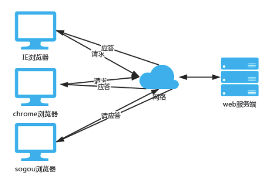
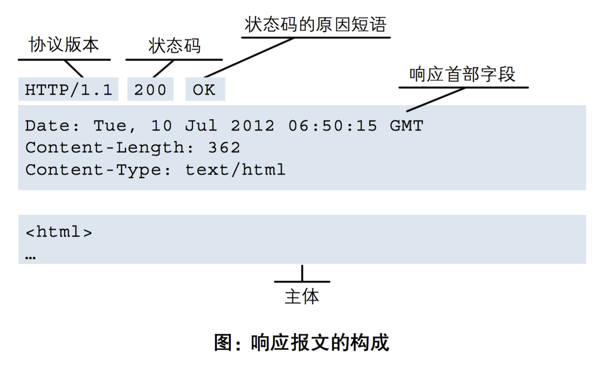
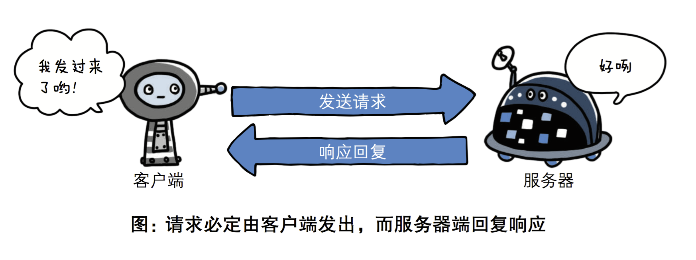
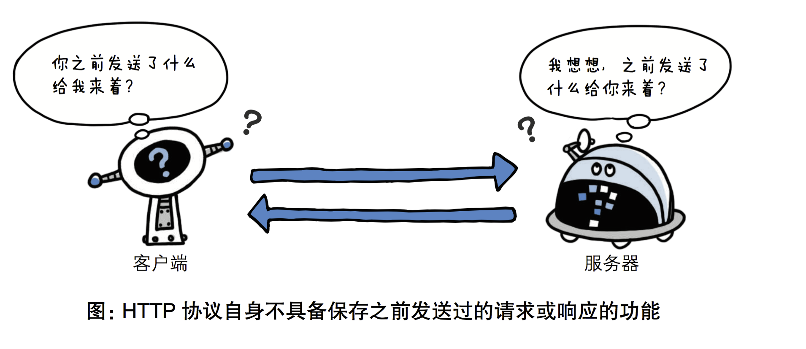

### 软件开发的架构 

- 目前我们了解的涉及到两个程序之间通讯的应用大致可以分为两种：
  - 第一种是应用类：qq、微信、网盘、优酷这一类是属于需要安装的桌面应用
  - 第二种是web类：比如百度、知乎、博客园等使用浏览器访问就可以直接使用的应用
- 这些应用的本质其实都是两个程序之间的通讯。而这两个分类又对应了两个软件开发的架构：
  - C/S架构
  - B/S架构

#### C/S架构

- C/S即：Client与Server ，中文意思：客户端与服务器端架构。
  - 我们把提供数据的一方称之为服务器(Server),把访问数据的一方称为客户端(Client)
  - 比如：电脑上要看视频就需要装看视频的程序.例如腾讯视频,它就是客户端程序,腾讯公司的机房里运行着腾讯视频的服务器程序,所以它也是C/S构架的程序


#### B/S架构

- B/S即：Browser与Server,中文意思：浏览器端与服务器端架构。

- Browser浏览器，其实也是一种Client客户端，只是这个客户端不需要大家去安装什么应用程序，只需在浏览器上通过HTTP/HTTPS协议请求服务器端相关的资源（网页资源）即可。



#### 和爬虫的关联

爬取服务器端的指定数据。

## 1.1、HTTP协议

### 1.1.1 、http协议简介

HTTP协议是Hyper Text Transfer Protocol（超文本传输协议）的缩写,是用于服务器与客户端之间传输**超文本**的传送**协议**。

超文本：超文本就是指“含有指向其他资源链接”内容的文本。大概就是，不仅仅是文字，还有多媒体：视频、图片、动画等。

协议：HTTP协议就是服务器（Server）和客户端（Client）之间进行数据交互（相互传输数据）的一种形式。我们可以将Server和Client进行拟人化，那么该协议就是Server和Client这两兄弟间指定的一种交互沟通方式。大家都看过智取威虎山中杨子荣和土匪们之间说的黑话吧：

```
- 土匪：蘑菇，你哪路？什么价？（什么人？到哪里去？）
- 杨子荣：哈！想啥来啥，想吃奶来了妈妈，想娘家的人，孩子他舅舅来了。（找同行）
- 杨子荣：拜见三爷！
- 土匪：天王盖地虎！（你好大的胆！敢来气你的祖宗？）
- 杨子荣：宝塔镇河妖！（要是那样，叫我从山上摔死，掉河里淹死。）
- 土匪：野鸡闷头钻，哪能上天王山！（你不是正牌的。）
- 杨子荣：地上有的是米，喂呀，有根底！（老子是正牌的，老牌的。）
- 土匪：拜见过阿妈啦？（你从小拜谁为师？）
- 杨子荣：他房上没瓦，非否非，否非否！（不到正堂不能说。）
- 土匪：嘛哈嘛哈？（以前独干吗？）
- 杨子荣：正晌午说话，谁还没有家？（许大马棒山上。）
- 土匪：好叭哒！（内行，是把老手）
- 杨子荣：天下大耷拉！（不吹牛，闯过大队头。）
- 座山雕：脸红什么？
- 杨子荣：精神焕发！
- 座山雕：怎么又黄了？
- 杨子荣：防冷，涂的蜡！
- 座山雕：晒哒晒哒。（谁指点你来的？）
- 杨子荣：一座玲珑塔，面向青寨背靠沙！（是个道人。）

是不是看到这里，有得童鞋终于知道了传说中的‘天王盖地虎’是真正含义了吧。此黑话其实就是杨子荣和土匪之间进行交互沟通的方式（协议）。
```

**http协议包含由浏览器发送数据到服务器需要遵循的【请求协议】与服务器发送数据到浏览器需要遵循的【响应协议】。**

### 1.1.2、http请求协议与响应协议

用于HTTP协议交互的信息被称为HTTP报文。请求端(客户端)的HTTP报文叫做请求报文,响应端(服务器端)的叫做响应报文。HTTP报文本身是由多行数据构成的字文本。

#### (1) 请求协议（重要）


- 请求头/报文头：

  - 请求头中存储的是该请求的一些主要说明（自我介绍）。服务器据此获取客户端的信息。

  - ```
    accept:浏览器通过这个头告诉服务器，它所支持的数据类型
    Accept-Charset: 浏览器通过这个头告诉服务器，它支持哪种字符集
    Accept-Encoding：浏览器通过这个头告诉服务器，支持的压缩格式
    Accept-Language：浏览器通过这个头告诉服务器，它的语言环境
    Host：浏览器通过这个头告诉服务器，想访问哪台主机
    If-Modified-Since: 浏览器通过这个头告诉服务器，缓存数据的时间
    Referer：浏览器通过这个头告诉服务器，客户机是哪个页面来的 防盗链
    Connection：浏览器通过这个头告诉服务器，请求完后是断开链接还是何持链接
    X-Requested-With: XMLHttpRequest 代表通过ajax方式进行访问
    User-Agent：请求载体的身份标识
    ```

- 报文体/请求体/请求参数：

  - 常被叫做请求体/请求参数，请求体中存储的是将要传输/发送给服务器的数据信息。

> 请求方式: get与post请求
>
> - GET提交的数据会放在URL之后，以?分割URL和传输数据，参数之间以&相连，如EditBook?name=test1&id=123456. 
> - POST方法是把提交的数据放在HTTP包的请求体中.
> - GET提交的数据大小有限制（因为浏览器对URL的长度有限制），而POST方法提交的数据没有大小限制，且携带的请求数据不可以明文方式连接在url中。

#### (2) 响应协议（了解）



- 响应头：

  - 响应头中存储的是该响应的一些主要说明（自我介绍）。客户端据此获取服务器的相关信息。

- ```
  Location: 服务器通过这个头，来告诉浏览器跳到哪里
  Server：服务器通过这个头，告诉浏览器服务器的型号
  Content-Encoding：服务器通过这个头，告诉浏览器，数据的压缩格式
  Content-Length: 服务器通过这个头，告诉浏览器回送数据的长度
  Content-Language: 服务器通过这个头，告诉浏览器语言环境
  Content-Type：服务器通过这个头，告诉浏览器回送数据的类型
  Refresh：服务器通过这个头，告诉浏览器定时刷新
  Content-Disposition: 服务器通过这个头，告诉浏览器以下载方式打数据
  Transfer-Encoding：服务器通过这个头，告诉浏览器数据是以分块方式回送的
  Expires: -1 控制浏览器不要缓存
  Cache-Control: no-cache
  Pragma: no-cache
  ```

- 响应体：

  - 根据客户端指定的请求信息，发送给客户端的指定数据

- 响应状态码：

  - 状态码指的是是当客户端向服务器端发送请求时, 返回的请求结果。借助状态码,用户可以知道服务器端是正常受理了请求,还是出现了什么问题错误 。


### 1.1.3、 http协议特性

#### 基于请求－响应模式

HTTP协议规定,请求从客户端发出,最后服务器端响应该请求并返回。换句话说,肯定是先从客户端开始建立通信的,服务器端在没有接收到请求之前不会发送响应



#### 无状态(重要)  

HTTP协议自身不对请求和响应之间的通信状态进行保存。每当有新的请求发送时,就会有对应的新响应产生。协议本身并不保留之前一切的请求或响应的相关信息。

状态可以理解为客户端和服务器在某次“会话”中产生的数据，那无状态的就以为这些数据不会被保留，也就是说客户端和服务器之间的这次通信, 和下次通信之间没有直接的联系。如果会话中产生的数据是我们需要保存的，也就是说要“保持状态”。

可是,随着Web的不断发展,因无状态而导致业务处理变得棘手的情况增多了。 比如,用户登录到一家购物网站,即使他再次请求跳转到该站的其他页面后,也需要能继续保持登录状态。网站为了能够掌握是谁送出的请求,需要保存用户的状态。



HTTP/1.1虽然是无状态协议,但为了实现期望的保持状态功能, 于是引入了Cookie技术。有了Cookie再用HTTP协议通信,就可以管理状态了。有关Cookie的详细内容稍后讲解。


## 1.2、Cookie概述

### 1.2.1 COOKIE的由来

- 大家都知道HTTP协议是无状态的。
  - 状态可以理解为客户端和服务器在某次会话中产生的数据，那无状态的就以为这些数据不会被保留。每当有新的请求发送时,就会有对应的新响应产生。协议本身并不保留之前一切的请求或响应的相关信息。
  - 一句有意思的话来描述就是人生只如初见，对服务器来说，每次的请求都是全新的，即使是同一个客户端发起的多个请求间。随着Web的不断发展,因无状态而导致业务处理变得棘手的情况增多，因此我们需要解决这个问题，也就是说要让http可以“保持状态”，那么Cookie就是在这样一个场景下诞生。

### 1.2.2 什么是cookie

- 首先来讲，cookie是浏览器的技术，Cookie具体指的是一段小信息，它是服务器发送出来存储在浏览器上的一组组键值对，可以理解为服务端给客户端的一个小甜点，下次访问服务器时浏览器会自动携带这些键值对，以便服务器提取有用信息。

记住：cookie表示的键值对数据是由服务器创建，且存储在客户端浏览器中。


### 1.2.3 cookie的原理（重点）

- cookie的工作原理是：
  - 浏览器访问服务端，带着一个空的cookie，然后由服务器产生内容，浏览器收到相应后保存在本地；
  
  - 当浏览器再次访问时，浏览器会自动带上Cookie，这样服务器就能通过Cookie的内容来判断这个是“谁”了。
  
  - cookie的内容是有服务器自主设计的，客户端无法干涉！
  
    
  
  注意，不同浏览器之间是不共享Cookie的。也就是说在你使用IE访问服务器时，服务器会把Cookie发给IE，然后由IE保存起来，当你在使用FireFox访问服务器时，不可能把IE保存的Cookie发送给服务器。

  - 举个例子：不同用户去访问登录某商城网站：
  - 
  - 举个例子： 这个过程和去医院看病很相似
    - 到了医院先挂号. 挂号时需提供身份证, 同时得到了一张“就诊卡”, 这个就诊卡就相当于患者的 “令牌”. 同时医院的系统中会记录用户的看病信息。
    - 后续去各个科室进行检查, 诊断, 开药等操作, 都不必再出示身份证了, 只要凭就诊卡即可识别出当前患者的身份，知道患者的病史。
    - 看完病了之后, 不想要就诊卡了, 就可以注销这个卡. 此时患者的身份和就诊卡的关联就销毁了. (类似于网站的注销操作)
    - 又来看病, 可以办一张新的就诊卡, 此时就得到了一个新的 “令牌”。
  - 就诊卡就是 Cookie, 服务器这边就需要记录令牌信息, 以及令牌对应的用户信息

# 第2章 、HTML（了解）

了解了web相关基本概念以后，我们开始正式接触网页开发，网页开发的基础是HTML，所以，本章内容主要是学会如何新建一个 HTML 页面和熟记HTML文档的基本结构和主要标签。

## 2.1、 HTML概述

* HTML，即超文本标记语言（HyperText Markup Language ]），也可叫做web页面。扩展名是 .html 或是 .htm 。

* HTML，是一种用来制作网页的标准标记语言。超文本，指的就是超出普通文本范畴的文档，可以包含文本、图片、视频、音频、链接等元素。

* HTML 不是一种编程语言，而是一种写给网页浏览器、具有描述性的标记语言。

也就是说：使用HTML语言描述的文件，需要通过网页浏览器显示出效果。用户在访问网页时，是把服务器的HTML文档**下载** 到本地客户设备中，然后通过本地客户设备的浏览器将文档按顺序解释渲染成对应的网页效果。

网页本身是一种文本文件，通过在文本文件中添加各种各样的标记标签，可以告诉[浏览器](http://baike.baidu.com/view/7718.htm)如何显示标记中的代表的内容，如：HTML中有的标签可以告诉浏览器要把字体放大，就像word一样，也有的标签可以告诉浏览器显示指定的图片，还有的标签可以告诉浏览器把内容居中或者倾斜等等。

每一个HTML标签代表的意义都不一样。同样，他们在浏览器中表现出来的外观也是不一样的。

## 2.2、 HTML结构和标签格式

```html
<!DOCTYPE html>
<html lang="en">
<head>
    <meta charset="UTF-8">
    <title>123</title>
</head>
<body>
	
</body>
</html>

```

> 1、`<!DOCTYPE html>` 告诉浏览器使用什么样的解析器来解析`html`文档
>
> 2、`<html></html>`是文档的开始标记和结束标记。此元素告诉浏览器其自身是一个 `HTML `文档，在它们之间是文档的头部`<head>`和主体`<body>`。	
>
> 3、<head></head>元素出现在文档的开头部分。<head>与</head>之间的内容不会在浏览器的文档窗口显示，但是其间的元素有特殊重要的意义。
>
> 4、`<title></title>`定义网页标题，在浏览器标题栏显示。
>
> 5、`<body></body>`之间的文本是可见的网页主体内容
>
> 6、`<meta charset="UTF-8"> `  声明编码方式用utf8

## 2.3、标签的语法

```html
<标签名 属性1=“属性值1” 属性2=“属性值2”……>内容部分</标签名>
<标签名 属性1=“属性值1” 属性2=“属性值2”…… />
```

> 1、HTML标签是由尖括号包围的特定关键词
>
> 2、标签分为闭合和自闭合两种标签
>
> 3、HTML不区分大小写
>
> 4、标签可以有若干个属性,也可以不带属性,比如<head>就不带任何属性

- 注意：网页中显示的我们可以看到的数据/内容都只可以存储或者写在标签之间或者属性中！

## 2.4、基本标签

* 标题标签

```html
<h1>标题1</h1>
<h2>标题2</h2>
<h3>标题3</h3>
<h4>标题4</h4>
<h5>标题5</h5>
<h6>标题6</h6>
```

* 段落标签

```html
<p>大家好，我是段落1。</p>
<p>大家好，我是段落2。</p>
<p>大家好，我是段落3。</p>
```

* 换行标签

```html
<p>大家好，我是段落标签p。我按了enter一下
换行了</p>

<p>大家好，我是段落标签p。我按了enter一下<br/> 换行了</p>
```

* 文本格式化标签

HTML提供了一系列的用于格式化文本的标签，可以让我们输出不同外观的元素，比如粗体和斜体字。如果需要在网页中，需要让某些文本内容展示的效果丰富点，可以使用以下的标签来进行格式化。

```html
<b>定义粗体文本</b><br />
<strong>定义粗体文本方式2</strong><br />
<em>定义斜体字</em><br />
<i>定义斜体字方式2</i><br />
<del>定义删除文本</del><br />
```

* 特殊符号

```html
&nbsp; 
```

> 标签大致可分为两类
>
> *  块级标签(block)  -- 独占一行 
> *  内联标签(inline)  -- 按文本内容占位

* div和span标签

````html
<div>只是一个块级元素，并无实际的意义。主要通过CSS样式为其赋予不同的表现.
<span>表示了内联行(行内元素),并无实际的意义,主要通过CSS样式为其赋予不同的表现
````


块级元素与行内元素的区别：所谓块元素，是以另起一行开始渲染的元素，行内元素则不需另起一行。如果单独在网页中插入这两个元素，不会对页面产生任何的影响。这两个元素是专门为定义CSS样式而生的。

## 2.5、超链接标签

### 2.5.1、超链接基本使用

超链接是浏览者和服务器的交互的主要手段，也叫超级链接或a链接，是网页中指向一个目标的连接关系，这个目标可以是网页、网页中的具体位置、图片、邮件地址、文件、应用程序等。

超链接是网页中最重要的元素之一。一个网站的各个网页就是通过超链接关联起来的，用户通过点击超链接可以从一个网页跳转到另一个网页。

几乎可以在所有的网页中找到链接。点击链接可以从一张页面跳转到另一张页面。例如,在阅读某个网站时，遇到一个不认识的英文，你只要在这个单词上单击一下，即可跳转到它的翻译页面中，看完单词的解释后点一下返回按钮，又可继续阅读，这就是超链接的常见用途。还有经常到购物网站中去，我们都是在百度搜索，然后点击对应的搜索项进入到对应的购物网站的，这也是超链接的作用。超链接的属性：

| 属性   | 值                                                           | 描述                                                         |
| ------ | ------------------------------------------------------------ | ------------------------------------------------------------ |
| href   | 网络链接 [ 例如: http://www.baidu.com ]     本地链接 [ 例如：F:\html\index.html ] | 规定链接的跳转目标                                           |
| title  | <a href="http://www.baidu.com" title="国内最著名的搜索引擎网站">百度</a> | 链接的提示信息                                               |
| target | _blank [ 在新建窗口中打开网页 ]                                                                                       _self  [ 默认值，覆盖自身窗口打开网页 ] | 与前面四项固定值不同，framename是泛指，并不是这个值，这点将在后面框架部分内容中详细介绍，这里可以暂时先略过 |

> 1、href是超链接最重要的属性，规定了用户点击链接以后的跳转目标，这个目标可以是 网络连接，也可以是本地连接。
>
> 2、网络链接指的是依靠网络来进行关联的地址，一般在地址前面是以 http://或者https://这样开头的，如果没有网络，则用户点击了超链接也无法访问对应的目标。
>
> 3、本地链接指的是本地计算机的地址，一般在地址前面是以 file:///开头或直接以 C:/、D:/、E:/开头的，不需要经过网络。
>
> 4、如果href的值留空，则默认是跳转到当前页面，也就是刷新当前页面。

## 2.6、img标签

在HTML中，图像由标签定义的，它可以用来加载图片到html网页中显示。网页开发过程中，有三种图片格式被广泛应用到web里，分别是 jpg、png、gif。

img标签的属性：

```go
/*
src属性：
    指定图像的URL地址，是英文source的简写，表示引入资源。
    src的值可以是本地计算机存储的图片的地址，也可以是网络上外部网站的图片的地址。
    如果src的值不正确，那么浏览器就无法正确的图片，而是显示一张裂图。

alt属性：指定图像无法显示时的替换文本。当图像显示错误时，在图像位置上显示alt的值。如上所示，就是谷歌浏览器中，引入图像失败后，显示了替换文本。

width属性： 指定引入图片的显示宽度。
height属性：指定引入图片的显示高度。
border属性：指定引入图片的边框宽度，默认为0。
title属性：悬浮图片上的提示文字
*/
```

点击图片跳转可以配合a标签使用

```html
<a></a>
```

## 2.7、列表标签

```html
  <ul type="square">
      <li>item1</li>
      <li>item2</li>
      <li>item3</li>
  </ul>

  <ol start="100">
      <li>item1</li>
      <li>item2</li>
      <li>item3</li>
  </ol>
```

## 2.8、表格标签

在HTML中使用table来定义表格。网页的表格和办公软件里面的xls一样，都是有行有列的。HTML使用tr标签定义行，使用td标签定义列。

语法：

```html
<table border="1">
  <tr>
    <td>单元格的内容</td>
    ……
  </tr>
  ……
</table>


```

> 1、`<table>`和`</table>`表示一个表格的开始和结束。一组`<table>...</table>`表示一个表格。
>
> 2、border用于设置整个表格的边框宽度，默认为0，表示不显示边框。
>
> 3、`<tr>`和`</tr>`表示表格中的一行的开始和结束。一组`<tr>...</tr>`，一个表格可以有多行。通过计算table标签中包含多少对tr子标签即可知道一个表格有多少行。
>
> 4、`<td>`和`</td>`表示表格中的一个单元格的开始和结束。通过计算一个tr里面包含了多少对td自标签即可知道一个表格有多少列，多少的单元格了。

**table属性**

| 属性                                                         | 值                             | 描述                               |
| ------------------------------------------------------------ | ------------------------------ | ---------------------------------- |
| [width](http://www.w3school.com.cn/tags/att_table_width.asp) | px、%                          | 规定表格的宽度。                   |
| height                                                       | px、%                          | 规定表格的高度。                   |
| [align](http://www.w3school.com.cn/tags/att_table_align.asp) | left、center、right            | 规定表格相对周围元素的对齐方式。   |
| [bgcolor](http://www.w3school.com.cn/tags/att_table_bgcolor.asp) | rgb(x,x,x)、#xxxxxx、colorname | 规定表格的背景颜色。               |
| background                                                   | url                            | 规定表格的背景图片。               |
| [border](http://www.w3school.com.cn/tags/att_table_border.asp) | px                             | 规定表格边框的宽度。               |
| [cellpadding](http://www.w3school.com.cn/tags/att_table_cellpadding.asp) | px、%                          | 规定单元格边框与其内容之间的空白。 |
| [cellspacing](http://www.w3school.com.cn/tags/att_table_cellspacing.asp) | px、%                          | 规定单元格之间的空隙。             |

**td属性**

表格中除了行元素以外，还有单元格，单元格的属性和行的属性类似。td和th都是单元格。

| 属性                                                         | 值                             | 描述                           |
| ------------------------------------------------------------ | ------------------------------ | ------------------------------ |
| height                                                       | px、%                          | 规定单元格的高度。             |
| width                                                        | px、%                          | 规定单元格的宽度。             |
| [align](http://www.w3school.com.cn/tags/att_table_align.asp) | left、center、right            | 规定单元格内容的对齐方式。     |
| valign                                                       | top、middle、bottom            | 规定单元格内容的垂直对齐方式。 |
| [bgcolor](http://www.w3school.com.cn/tags/att_table_bgcolor.asp) | rgb(x,x,x)、#xxxxxx、colorname | 规定单元格的背景颜色。         |
| background                                                   | url                            | 规定单元格的背景图片。         |
| rowspan                                                      | number                         | 规定单元格合并的行数           |
| colspan                                                      | number                         | 规定单元格合并的列数           |

```
<html>
<head>
    <title>i am title</title>
    <meta charset="utf-8">
</head>
<body>
    <table border=1px width="700" height="500">
        <tr>
            <td colspan="2">1</td>
            <td rowspan="2">3</td>
        </tr>
        <tr>
            <td>5</td>
            <td>6</td>
        </tr>
    </table>
</body>
</html>
```


## 2.9、表单标签

表单主要是用来收集客户端提供的相关信息，提供了用户数据录入的方式，有多选、单选、单行文本、下拉列表等输入框，便于网站管理员收集用户的数据，是Web浏览器和Web服务器之间实现信息交流和数据传递的桥梁.

表单被form标签包含，内部使用不同的表单元素来呈现不同的方式来供用户输入或选择。当用户输入好数据后，就可以把表单数据提交到服务器端。

一个表单元素有三个基本组成部分：

* 表单标签，包含了表单处理程序所在的URL以及数据提交到服务器的方法等表单信息。 

* 表单域，包含了文本框、密码框、隐藏域、多行文本框、复选框、单选框、下拉选择框和文件上传框等表单控件。

* 表单按钮，包括提交按钮、复位按钮和一般按钮，用于将数据传送到服务器上。

在HTML中创建表单用form标签。每个表单都可以包含一到多个表单域或按钮。form标签属性：

| 属性    | 值                                                           | 描述                          |
| ------- | ------------------------------------------------------------ | ----------------------------- |
| action  | 访问服务器地址                                               | 服务器端表单处理程序的URL地址 |
| method  | post、get[默认值]                                            | 表单数据的提交方法            |
| target  | 参考超链接的target属性                                       | 表单数据提交时URL的打开方式   |
| enctype | application/x-www-form-urlencoded[默认值]    multipart/form-data [用于文件上传]                                                        text/plain [用于纯文本数据发送] | 表单提交数据时的编码方式      |

```html
<!DOCTYPE html>
<html lang="en">
<head>
    <meta charset="UTF-8">
    <title>Title</title>
</head>
<body>
    <form action="#" method="post">
        <label>用户名：</label>
        <input type="text" name="username"/><br/>
        <label>密码：</label>
        <input type="password" name="password"/><br/>
        <label>爱好：</label>
<!--        value属性就是提交给服务器的内容，服务器根据该内容就是到用户选择的是哪一项-->
        <input type="checkbox" name="hobby" value="lanqiu">篮球
        <input type="checkbox" name="hobby" value="zuqiu">足球
        <input type="checkbox" name="hobby" value="qumao">羽毛球
        <input type="checkbox" name="hobby" value="gaoer">高尔夫
        <br/>
        <label>性别：</label>
<!--        单选框的name属性值必须一样，否则无法实现单选-->
        <input type="radio" name="sex" value="male">男
        <input type="radio" name="sex" value="female">女
        <br/>
        <label>生日：</label>
        <input type="date" name="birthday"><br>
        <label>籍贯：</label>
        <select name="jiguan">
            <option>请选择籍贯</option>
            <option value="hebei">河北</option>
            <option value="anhui">安徽</option>
            <option value="liaoning">辽宁</option>
        </select>
        <br>
        <label>自我介绍：</label>
        <textarea cols="30" rows="10" placeholder="请描述" name="self"></textarea>
        <br>
        <input type="submit" value="提交">
        <input type="reset" value="重置">
    </form>
</body>
</html>
```

- 文件上传:必须将文件的二进制形式的数据提交给服务器

- ```html
  <form action="#" method="post" enctype="multipart/form-data">
      <input type="file">
      <input type="submit" value="上传文件">
  </form>
  ```


## 2.10、多媒体标签

视频标签：

```
<video src="路径" controls  autoplay width="300px"></video>

标签属性：
  autoplay属性控制是否网页加载自动播放　　

  controls 是否显示播放控件，默认不显示

  loop 属性用于控制循环次数，如果值为正整数，则播放指定的次数，如果是 loop 或者是 loop = -1，则无线循环播放。

  width 属性设置播放窗口宽度

  height 属性设置播放窗口高度

  由于版权等原因，不同的浏览器可支持播放的格式是不一样的
```

```html
<!DOCTYPE html>
<html lang="en">
<head>
    <meta charset="UTF-8">
    <title>Title</title>
</head>
<body>
    <video src="https://video.pearvideo.com/mp4/adshort/20211029/cont-1744852-15789500_adpkg-ad_hd.mp4" controls  autoplay width="600px"></video>

</body>
</html>
```

音频标签：

```
<audio src="路径"  autoplay="autoplay" controls="true" loop=2></audio>
标签属性：
	autoplay属性控制是否网页加载自动播放
  controls 是否显示播放控件，默认不显示
  loop 属性用于控制循环次数，如果值为正整数，则播放指定的次数，如果是 loop 或者是 loop = -1，则无线循环播放。
  由于版权等原因，不同的浏览器可支持播放的格式是不一样的

```

```html
<!DOCTYPE html>
<html lang="en">
<head>
    <meta charset="UTF-8">
    <title>Title</title>
</head>
<body>
    <audio src="https://video.pearvideo.com/mp4/adshort/20211029/cont-1744852-15789500_adpkg-ad_hd.mp4" controls  autoplay width="600px"></audio>

</body>
</html>
```


