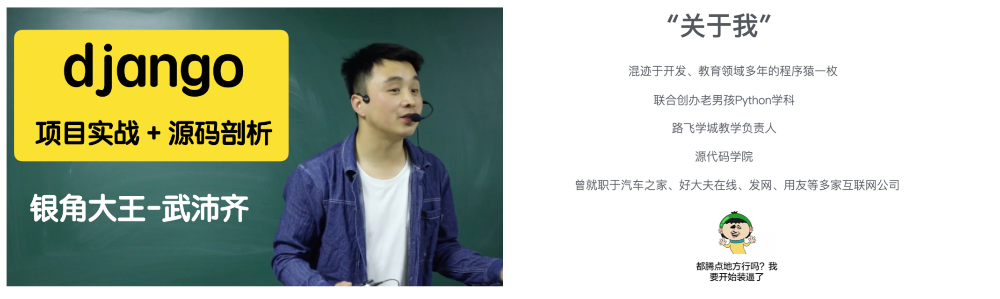
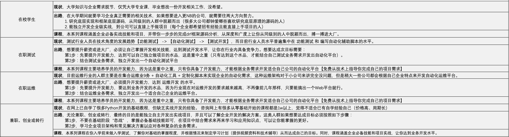
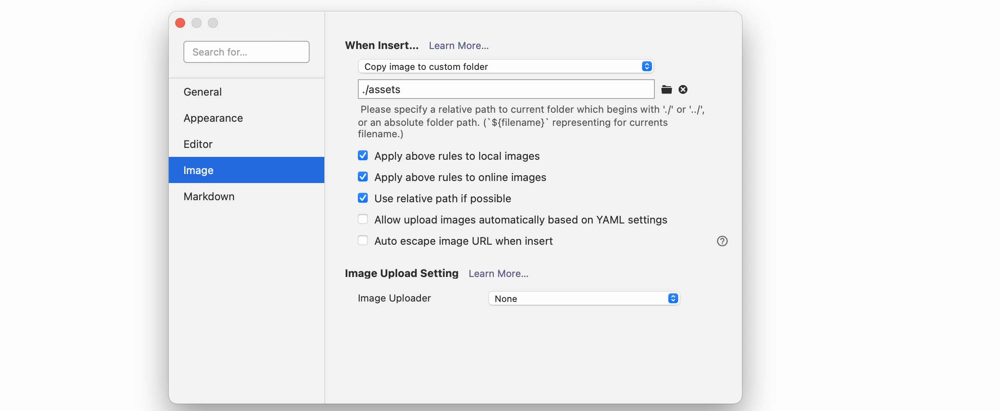
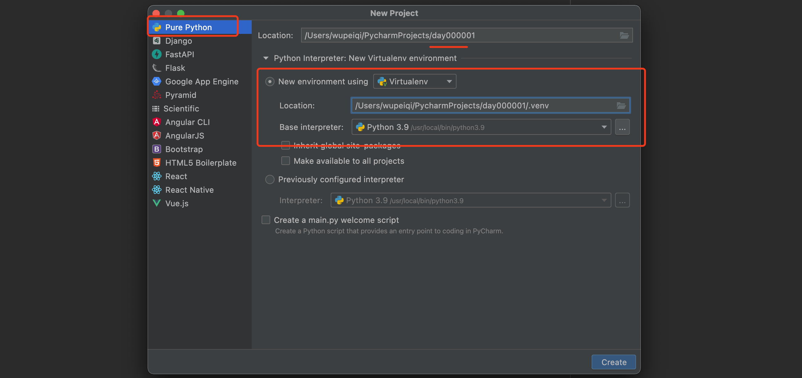
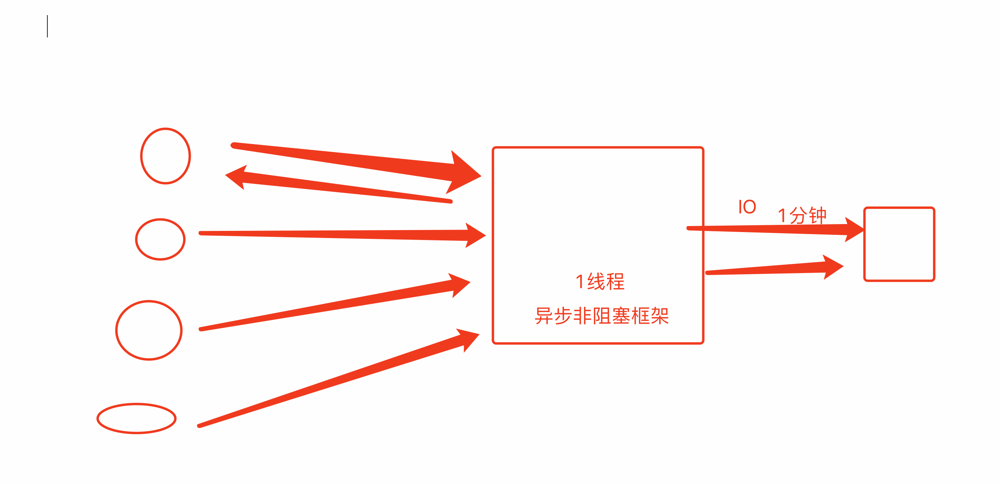

# 开班啦

**欢迎大家来《django项目实战班》**




先聊几个大家关心的问题：

- **为什么要做这个课？**

  ```
  - 自学的人很多，苦于没有项目需求和实战。
  - 市面上课程太贵，不值。
  ```

- **通过这个课你能得到什么？**

  

- **什么样的"姿势"效果最好？**

  ```
  带着目标学习，最终做到独立自主的开发项目（进入企业的最低门槛）。
  - 听课，学知识和技能。（尽量在周1/2/3搞定）
  - 学习并设计自己的项目。（从业务设计到最终实现，毕业的同时，也可以把自己的项目独立完成）
  	- 功能设计（经常看)
  	- 原型设计
  	- 表结构设计 & 单独功能评估
  	- 开发
  	- 项目部署
  ```

  

## 1.关于课程

- 直播授课

  ```
  在腾讯会议，会议连接和密码，请关注群公告（不定期更新）。
  ```

- 上课时间

  ```
  每周日，正课时间：
  	上午： 9:00 ~ 12:00
  	下午：14:00 ~ 18:00
  
  注意：6月19日正式开课。如遇特殊问题，会提前在群里公告说明。
  ```

- 关于课件

  ```
  详见课件下载
  ```

- 关于录播视频

  ```
  在路飞平台进行观看
  ```


  

- 关于答疑

  ```
  - 授课讲师：武沛齐
  - 答疑讲师：张开（不善言辞，有很多干货，为人也确实是sao）
  
  -   班主任：班主任-沙河一霸 & 班主任-昌平扛把子
  ```


## 2.关于知识点

- 前置课

  ```
  - Python环境搭建（Python解释器、Pycharm、环境变量等）    【重点】
  - 基础语法（条件、循环、输入输出、编码等）                【重点】
  - 数据类型（整型、布尔型、字符串、列表、字典、元组、集合等） 【重点】
  - 函数（文件操作、返回值、参数、作用域等）                【重点】
  
  - 面向对象（类、对象、封装、继承、多态等）
  - 包和模块（内置包、时间处理、序列化等）
  
  - 前端开发（ HTML、CSS、JavaScript、jQuery等）         【重点】
  - 数据库（MySQL、pymysql、数据库连接池、等）             【重点】
  
  前置课程资料：
  	         基础v1版：https://www.bilibili.com/video/BV1nF411j71V
  	         基础v2版：https://www.bilibili.com/video/BV1Gu411k7e4
  	         基础v3版：https://www.bilibili.com/video/BV1b3411a7aG
  	前端+数据库+django：https://www.bilibili.com/video/BV1rT4y1v7uQ
  ```

- 正课

  ```
  django框架、内置核心组件、自定义扩展、源码、项目部署...
  详细见课表。
  ```


## 3.关于笔记

推荐大家使用typora记录相关笔记。

- 直播上课，不要详细笔记。
- 课下笔记（django、vue、drf、小程序）


推荐使用: typora软件。

- typora工具。
- markdown格式的笔记。


### 3.1 常见操作

- 配置图片
  
- 第一步新建就要保存，不然图片就在临时目录。
- 目录结构和视图的切换
- 常见的格式
  - 标题
  - 列表
  - 代码
  - 图片
  - 表格

### 3.2 传输笔记

- pdf
- 笔记+assets


## 4.关于环境

- CPython解释器 & 安装路径 & 环境变量（3.7+ or 3.9+）
- Pycharm专业版（2021.3）

- 虚拟环境


### 4.1 CPython解释器

- 语法

  ```python
  v = []
  v[xxx] = 123
  v.append(2)
  ```

- 龟叔，用C语言写了Python解释器（翻译）。

  - 版本：3.9+  3.8+   3.7+

  - 深入研究：列表底层存储原理、字典、垃圾回收机制。

    ```
    https://pythonav.com/wiki/detail/6/88/
    ```

- 环境统一

  - 安装你能找到的目录（不建议默认安装）

    ```
    win: 
    	C:\Python37\
    	C:\Python38\
    	C:\Python39\
    		- python.exe
    		- Scripts
    			- pip.exe
    		- Lib
    			- re.py
    			- random.py
    			- site-pakages
    				- 第三方模块
    	环境变量
    		C:\Python39\
    		C:\Python39\Scripts
    	
    	>>>python
    	>>>pip install xxx
    	
    mac：
    	/Library/Frameworks/Python.framework/Versions/
    	...
    ```

    ```
    现象：pip install xxxxx
    
    1.安装了好几个解释器
    2.运行程序
    ```

    

### 4.2 IDE

推荐Pycharm专业版

- 2020.1版本，不推荐。
- **2021.3版本，推荐。**
- 2022.1版本，不稳定。


关于目录：

- Python解释器安装目录    `C:\Python39`

- Pycharm随便。

- 项目&代码目录  `D:\PycharmProjects\...`

  

  

### 4.3 虚拟环境

- 系统解释器

  ```
  	C:\Python39\
  		- python.exe
  		- Scripts
  			- pip.exe
  		- Lib
  			- re.py
  			- random.py
  			- site-pakages
  				- 第三方模块
  				- django==3.2
  ```

  ```
  pip install django==1.1
  pip install django==3.2
  ```

  问题：

  - A项目，django3.2
  - B项目，django1.1

- 虚拟环境

  ```python
  虚拟环境A:
      - python.exe
      - Scripts
      	pip.exe
  	- Lib
  		- re.py
  		- random.py
  		- site-pakages
  			- 第三方模块
  			- django==1.1
              
  虚拟环境B:
      - python.exe
      - Scripts
      	pip.exe
  	- Lib
  		- re.py
  		- random.py
  		- site-pakages
  			- 第三方模块
  			- django==3.2
  ```

  注意：后期每个项目 创建项目+环境




## 5.Q/A




