# day03 django必备知识点

## 1.回顾

- 虚拟环境

  ```
  不同项目用到不同版本的第三方模块时，才会用到虚拟环境。
  ```

  ```
  pip install virtualenv
  ```

  ```
  virtualenv xxx --python=python3.9
  virtualenv xxx/xx/xxx/xx --python=python3.9
  ```

  ```
  xxx/xx/xxx/xx/activate
  (base)>>>pip
  (base)>>>python
  ```

  ```
  (base)>>>deactivate
  ```

  注意：以后项目部署时，都需要命令来做。

- django

  ```
  pip install django==3.2
  ```

  ```
  django-admin startproject 项目名
  
  cd 项目名
  python manage.py startapp app01
  python manage.py startapp app02
  
  python manage.py runserver 127.0.0.1:8000
  ```

- 开发时，Pycharm+虚拟环境

  - Pycharm+虚拟环境+普通项目

  - Pycharm+虚拟环境+django项目（最新版本）

  - Pycharm+虚拟环境+django项目（指定版本）

    - Pycharm+虚拟环境+普通项目

    - 安装django

      ```
      pip install django==3.2
      ```

    - 创建项目

      ```
      django-admin startproject  项目名    .
      ```

    - 创建app

      ```
      python manage.py startapp app01
      python manage.py startapp app02
      ```

    - 运行

      ```
      python manage.py runserver 127.0.0.1:8000
      ```

- 多app应用
- 纯净版


问题：

1. 虚拟环境什么时候放在项目目录下？什么时候放在别的地方？

   ```
   在F:\envs\learning创建环境
   在D:\proj项目目录下创建项目
   	- day01
   		pip install xxx
   		pip install xxx
   	- day02
   	- day03
   ```

   ```
   在D:\proj项目目录下创建项目
   	.venv
   ```

2. 打开项目

   ```
   - 打开项目
   - 手动创建虚拟环境（命令行）
   - pycharm配置项目+环境关联
   ```

   ```
   - 打开项目
   - 创建虚拟环境 + 项目和环境关联
   ```


## 2.今日概要

- 路由系统
- 视图
- 模板
- 静态文件和媒体文件
- 中间件
- ORM（时间）


## 3.路由系统

本质上：URL和函数的对应关系。


### 3.1 传统的路由

```python
from django.contrib import admin
from django.urls import path
from apps.web import views

urlpatterns = [
    path('home/', views.home),
    path('news/<int:nid>/edit/', views.news),
    path('article/', views.article),
]
```

```python
from django.shortcuts import render, HttpResponse


def home(request):
    return HttpResponse("成功")


def news(request, nid):
    print(nid)
    page = request.GET.get("page")
    return HttpResponse("新闻")


def article(request):
    nid = request.GET.get("nid")
    print(nid)
    return HttpResponse("文章")
```


- int，整数
- str，字符串   /
- 
- slug，字母+数字+下滑线+-
- uuid，uuid格式
- path，路径，可以包含 /


### 3.2 正则表达式路由

- 在django1版本用的多。
- 在django2+版本用的少

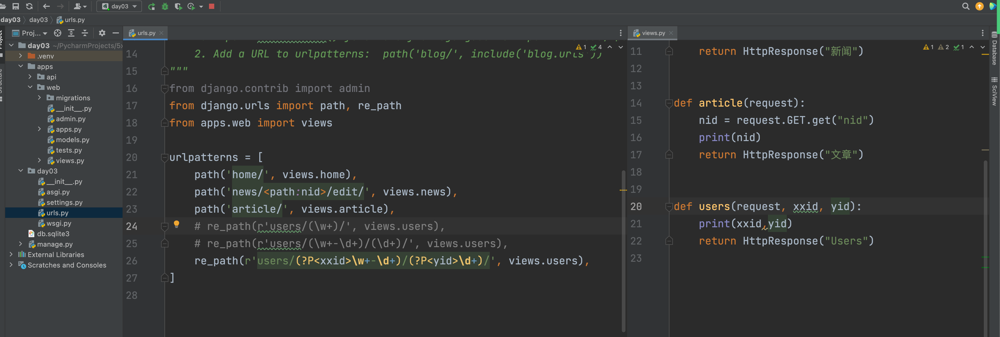


### 3.3 路由分发

假如：200个功能。

inlucde + app（一般），将功能拆分不到不同的app中。

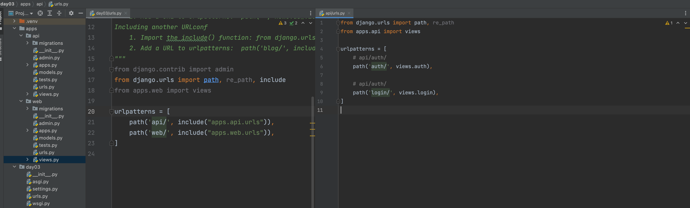


手动路由分发，可以与app无关。

```python
path('user/add/', views.login),
path('user/delete/', views.login),
path('user/edit/', views.login),
path('user/list/', views.login),


path('user/', ([
                   path('add/', views.login),
                   path('delete/', views.login),   # /user/delete/
                   path('edit/', views.login),
                   path('list/', views.login),
               ], None, None)),

纯粹帮助提取功能的URL，防止重复编写。
```


路由分发的本质：

- URL对应函数

  ```python
  path('user/add/', views.login),
  ```

- URL对应元组

  ```
  path('user/add/',    (元素,appname元素,namespance元素)    ),
  ```

  ```python
  path('user/add/',    include("apps.api.urls")    ),
  path('user/add/',     ([],None,None)     ),
  ```

  

#### 小结

- include或手动元组列表，本质相同。

- 应用场景和意义，想要把一些URL前缀提取出来。

  ```
  path('user/add/', views.login),
  path('user/delete/', views.login),
  path('user/edit/', views.login),
  path('user/list/', views.login),
  
  
  path('user/', ([
                     path('add/', views.login),
                     path('delete/', views.login),   # /user/delete/
                     path('edit/', views.login),
                     path('list/', views.login),
                 ], None, None)),
                 
                 
  path('users', include(([
                             path('add/', views.login),
                             path('delete/', views.login),  # /user/delete/
                             path('edit/', views.login),
                             path('list/', views.login),
                         ], None))),
                         
  include("apps.api.urls")  # 一般是每个app中urls
  urlpatterns = [
  
  ]
  ```

  

### 3.4 name

给一个路由起个名字 + 根据名字反向生成URL。

```python
urlpatterns = [
    path('login/', views.login),
]
```

```python
# 很多功能，很多URL
urlpatterns = [
    path('login/', views.login, name="v1"),
    path('auth/', views.auth, name="v2"),
]
```

有了名字后，以后一般有两处会用到：

- 在视图函数中生成URL

  ```
  from django.urls import reverse
  url = reverse("v2")   # /auth/
  url = reverse("v1")   # /login/
  ```

- HTML模板，页面上有一个a标签，添加xx。

  ```html
  <a href="/xxx/xxx/xx/">添加</a>
  ```

  ```html
  <a href="">添加</a>
  <a href="">添加</a>
  ```

- 扩展

  ```
  以后做权限管理，让name属性配合。
  ```

  

  

  

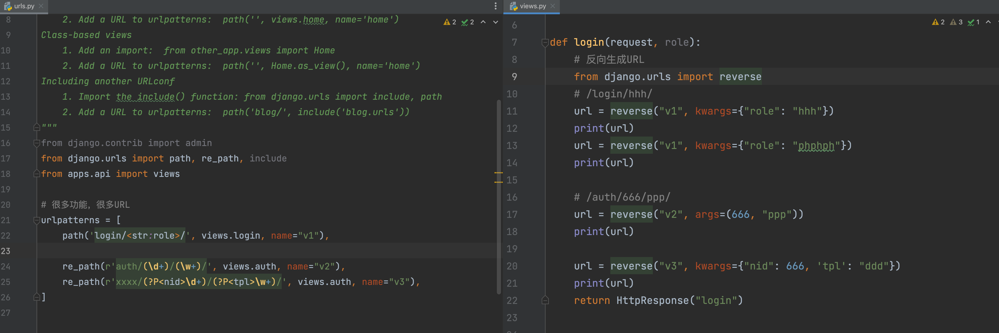

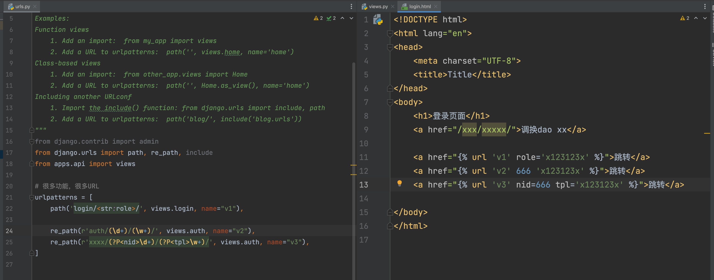


### 3.5 namespace

辅助name。

- 主路由

  ```python
  from django.urls import path, re_path, include
  
  # 很多功能，很多URL
  urlpatterns = [
      path('api/', include("apps.api.urls",namespace='x1')),
      path('web/', include("apps.web.urls",namespace='x2')),
  ]
  ```

- api/urls.py

  ```python
  from django.urls import path, re_path
  from . import views
  # 很多功能，很多URL
  urlpatterns = [
      path('login/', views.login,name="login"),
      path('auth/', views.auth, name='auth'),
  ]
  ```

- web/urls.py

  ```python
  from django.urls import path, re_path
  from . import views
  # 很多功能，很多URL
  urlpatterns = [
      path('home/', views.home,name='home'),
      path('order/', views.order,name='order'),
      path('auth/', views.order, name='auth'),
  ]
  ```


以后再某个URL或者视图中反向生成：

```python
from django.urls import reverse
url = reverse("x1:login")    # /api/login/
url = reverse("x1:order")    # /web/login/

url = reverse("x1:auth")    # /api/login/
url = reverse("x2:auth")    # /web/login/
```


两个扩展：

- namespace需要设置app_name

  ```
  urlpatterns = [
      path('api/', include("apps.api.urls", namespace='x1')),
  ]
  ```

  ```
  from django.urls import path, re_path
  from apps.api import views
  
  # 很多功能，很多URL
  urlpatterns = [
      path('login/', views.login, name="login"),
      path('auth/', views.auth, name='auth'),
  ]
  
  app_name = "api"
  ```

- 手动分发
  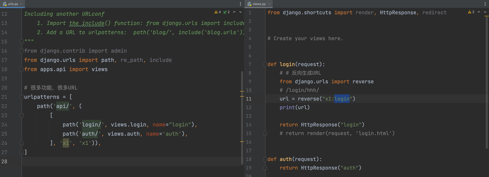


赠送：


### 3.4 最后的 / 如何解决？

APPEND_SLASH = True

```python
path('login/', views.login),
	http://127.0.0.1:8000/login/   成功

	http://127.0.0.1:8000/login    django，重定向301
	http://127.0.0.1:8000/login/   成功
```

```python
path('login', views.login),
	http://127.0.0.1:8000/login    成功

	http://127.0.0.1:8000/login    
	http://127.0.0.1:8000/login/   失败
```


APPEND_SLASH = False

```python
path('login/', views.login),
	http://127.0.0.1:8000/login/   成功

	http://127.0.0.1:8000/login    失败
```

```python
path('login', views.login),
	http://127.0.0.1:8000/login/   失败

	http://127.0.0.1:8000/login    成功
```


### 3.5 当前匹配对象

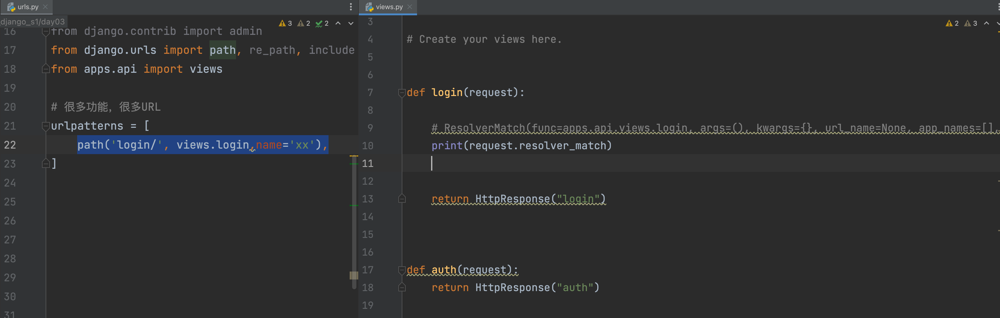


有什么用呀？

```
某用户，具有一些权限。   permissions = ["xx","login",'account']
某用户，具有一些权限。   permissions = ["login",'account']
```

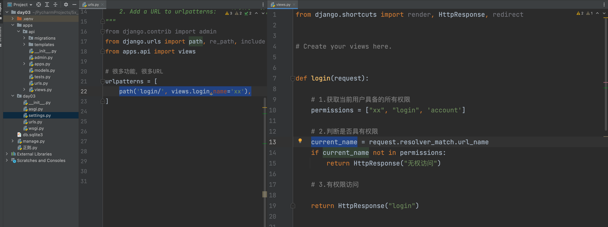


### 小结

- 常见 & 必须掌握
  - 传统路由
  - 路由分发
  - name
- 差点意思
  - 正则
  - namapace
  - 当前对象

- 补充小知识点（与django路由无关，看源码时有关）

  - 关于 partial

    ```python
    def _xx(a1, a2):
        return a1 + a2
    
    
    data = _xx(11, 22)
    print(data)
    
    ```

    ```python
    from functools import partial
    
    def _xx(a1, a2):
        return a1 + a2
    
    yy = partial(_xx, a2=100)
    
    data = yy(2)
    print(data)
    ```

    


## 4.视图


### 4.1 文件or文件夹

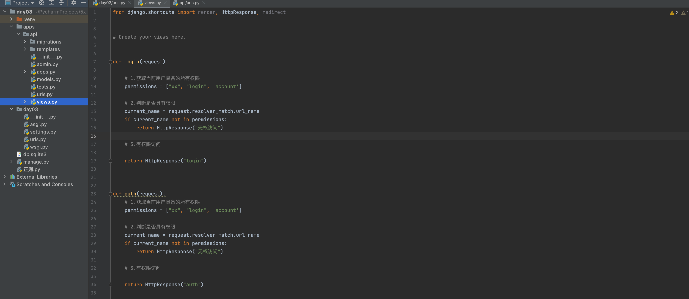


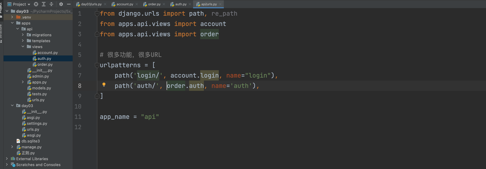


### 4.2 相对和绝对导入urls

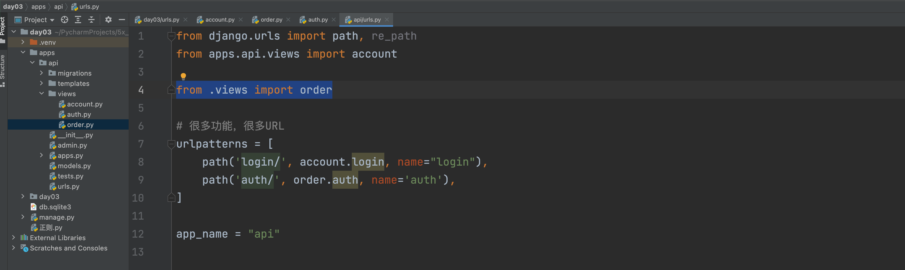

注意实现：不要再项目根目录做相对导入。

原则：

- 绝对导入
- 相对导入（层级深）


### 4.3 视图参数

```python
urlpatterns = [
    path('login/', account.login, name="login"),
    path('auth/', order.auth, name='auth'),
]

```

```python
from django.shortcuts import HttpResponse


def login(request):
    return HttpResponse("login")
```

requests是什么呢？

```
对象，包裹，可以放很多东西。

requests是一个对象，存放了浏览器给咱们发过来的所有内容，所以含有：
- 请求相关所有的数据： 当前访问的url、请求方式、...
- django额外添加的数据
```

```python
from django.shortcuts import HttpResponse


def login(request):
    # 1.当前URL  /api/login/
    print(request.path_info)

    # 2.URL传递的参数
    print(request.GET)
    print(request.GET.get("age"))

    # 3.请求方式  GET/POST
    print(request.method)

    # 4.如果post请求，传递请求体（原始数据）
    print(
        request.body)  # b'{"code":"083Sjmll2yla694F3bll2DguCM2SjmlG","unionId":"oP6QCsyT_9bk1dfSaVf0GEV5Y-yE"}'  b'v1=123&v2=456'

    # 4.1 请求体+请求头       b'v1=123&v2=456'  +  content-type:application/x-www-form-urlencoded
    print(request.POST)
    print(request.POST.get("v1"))
    print(request.POST.get("v2"))

    # 4.2 请求体+请求头   文件
    print(request.FILES)  # 文件格式           + multipart/form-data
    print(request.FILES.get("n1"))
    print(request.FILES.get("n2"))

    # 5.请求头
    # {'Content-Length': '', 'Content-Type': 'text/plain', 'Host': '127.0.0.1:8000', 'Connection': 'keep-alive', 'Cache-Control': 'max-age=0', 'Sec-Ch-Ua': '" Not A;Brand";v="99", "Chromium";v="102", "Google Chrome";v="102"', 'Sec-Ch-Ua-Mobile': '?0', 'Sec-Ch-Ua-Platform': '"macOS"', 'Upgrade-Insecure-Requests': '1', 'User-Agent': 'Mozilla/5.0 (Macintosh; Intel Mac OS X 10_15_7) AppleWebKit/537.36 (KHTML, like Gecko) Chrome/102.0.0.0 Safari/537.36', 'Accept': 'text/html,application/xhtml+xml,application/xml;q=0.9,image/avif,image/webp,image/apng,*/*;q=0.8,application/signed-exchange;v=b3;q=0.9', 'Sec-Fetch-Site': 'none', 'Sec-Fetch-Mode': 'navigate', 'Sec-Fetch-User': '?1', 'Sec-Fetch-Dest': 'document', 'Accept-Encoding': 'gzip, deflate, br', 'Accept-Language': 'zh-CN,zh;q=0.9,en;q=0.8,zh-TW;q=0.7', 'Cookie': 'csrftoken=CdidpKSGbLxzmOXnbmlkvrZep1eJmKLAA81T73UjcjxEnMOa4YOZqtc849AkYfUy'}
    print(request.headers)

    # 5.1 请求头有个特殊的cookie
    # request.headers['cookie']  # 'csrftoken=CdidpKSGbLxzmOXnbmlkvrZep1eJmKLAA81T73UjcjxEnMOa4YOZqtc849AkYfUy;session=xxxx'
    # {'csrftoken': 'CdidpKSGbLxzmOXnbmlkvrZep1eJmKLAA81T73UjcjxEnMOa4YOZqtc849AkYfUy'}
    print(request.COOKIES)

    # 6.requests中其他值
    print(request.resolver_match)

    return HttpResponse("login")
```


### 4.4 返回值

- HttpResponse
-  JsonResponse
- render
- redirect

```python
from django.shortcuts import HttpResponse, redirect, render
from django.http import JsonResponse


def auth(request):
    pass


def login(request):
    # 1.获取请求数据
    print(request)

    # 2.根据请求数据进行条件的判断 GET/POST   GET.get("xx")    POST.get("xx")

    # 3.返回数据

    # 3.1 字符串/字节/文本数据（图片验证码）
    # return HttpResponse("login")

    # 3.2 JSON格式（前后端分离、app小程序后端、ajax请求）
    # data_dict = {"status": True, 'data': [11, 22, 33]}
    # return JsonResponse(data_dict)

    # 3.3 重定向
    # return redirect("https://www.baidu.com")
    # return redirect("http://127.0.0.1:8000/api/auth/")
    # return redirect("http://127.0.0.1:8000/api/auth/")
    # return redirect("/api/auth/")
    # return redirect("/api/auth/")  # name
    #
    # from django.urls import reverse
    # url = reverse("auth")
    # return redirect(url)  # name
    # return redirect("auth")

    # 3.4 渲染
    # - a.找到 'login.html' 并读取的内容，问题：去哪里找？
    # -   默认先去settings.TEMPLATES.DIRS指定的路径找。（公共）
    # -   按注册顺序每个已注册的app中找他templates目录，去这个目录中寻找'login.html'
    # -   一般情况下，原则，那个app中的的模板，去哪个那个app中寻找。
    # - b.渲染（替换）得到替换完成的字符串
    # - c.返回浏览器
    return render(request, 'api/login.html')
```


### 4.5 响应头

```python
from django.shortcuts import HttpResponse, redirect, render
from django.http import JsonResponse


def login(request):
    res = HttpResponse("login")
    res['xx1'] = "hahaha"
    res['xx2'] = "hahaha"
    res['xx3'] = "hahaha"

    res.set_cookie('k1',"aaaaaaaa")
    res.set_cookie('k2',"bbbbbb")

    return res
```


### 4.6 FBV和CBV

- FBV，视图用函数的形式编写。**（目前主流）**
- CBV，视图用类的形式编写。


请注意，这一些都是表象，本质一模一样。


## 5.静态资源

静态资源：

- 开发需要：css、js、图片。

  ```
  - 根目录的 /static/
  - 已经app目录下载 /static/ 文件夹下
  ```

- 媒体文件：用户上传的数据(excel/pdf/video)

  ```
  - 根目录的 /media/
  ```


### 5.1 静态文件

```python
INSTALLED_APPS = [
    # 'django.contrib.admin',
    # 'django.contrib.auth',
    # 'django.contrib.contenttypes',
    # 'django.contrib.sessions',
    # 'django.contrib.messages',
    'django.contrib.staticfiles',
    "apps.api.apps.ApiConfig",
    "apps.web.apps.WebConfig",
]
...

STATIC_URL = '/static/'
STATICFILES_DIRS = (
    os.path.join(BASE_DIR, 'static'),
)
```

- 顺序：...

- 多app开发：各自app的图片放在各自  `/static/app名字/。。。`

- 在开发过程中

  - 禁止

    ```html
    
    ```

  - 建议

    ```html
    
    
    <!DOCTYPE html>
    <html lang="en">
    <head>
        <meta charset="UTF-8">
        <title>Title</title>
    </head>
    <body>
    <h1>登录页面</h1>
    <a href="/xxx/xxxxx/">调换dao xx</a>
    <a href="">跳转</a>
    
    
    
    </body>
    </html>
    ```

    


### 5.2 媒体文件

urls.py

```python
from django.contrib import admin
from django.urls import path, re_path, include
from django.conf.urls.static import static
from django.conf import settings

from apps.api import views


# 很多功能，很多URL
urlpatterns = [
    path('api/', include('apps.api.urls')),
] + static(settings.MEDIA_URL, document_root=settings.MEDIA_ROOT)
```

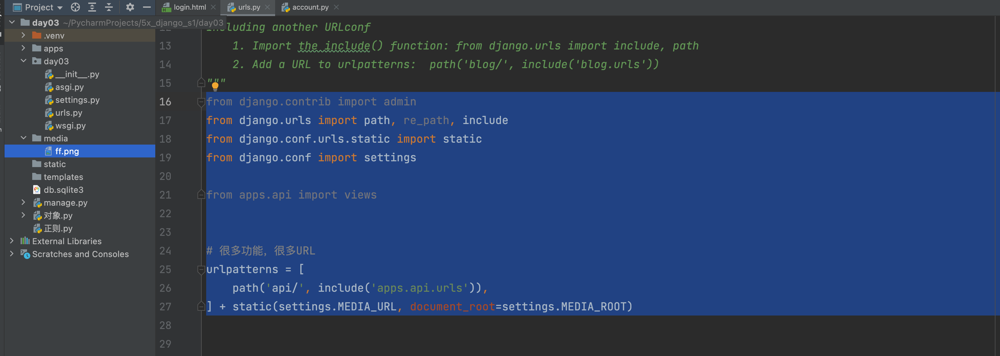

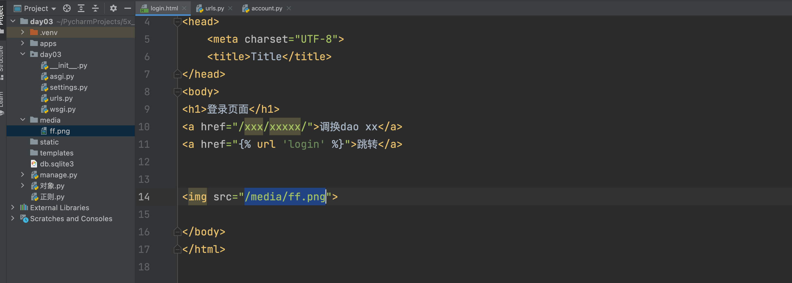


## 任务

1. 知识点搞定（动手操作） -> 知识点

2. 两种情况

   - 多app
   - 单app

3. 设计自己的项目（多app项目）

   - 几个app
   - 前缀url，分发
   - 模板和静态文件

4. 预习

   - Git版本控制

     ```
     - 先看   https://www.bilibili.com/video/BV19E411f76x?spm_id_from=333.999.0.0
     - 直接用
     ```

   - 中间价、ORM、缓存、session、cookie（全家桶）

     ```
     - 先看全家桶
     - 笔记 https://www.cnblogs.com/wupeiqi/articles/6216618.html
     ```

     


